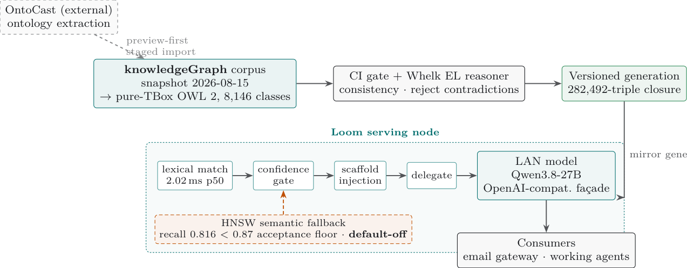

# The Copy Ceiling: An Input-Exposure Control for Ontology-Grounded Generation over Curated Corpora

- arXiv: https://arxiv.org/abs/2609.24885  (v2, submitted 2026-09-21, updated 2026-09-29)
- Authors: John J. O'Hare
- Categories: cs.CL, cs.CY
- Collected: 2026-10-06 (KST)

## Abstract

We built a node that grounds a replaceable language model in a maintained ontology corpus, then asked what its successful-looking evaluation could support. Across ten models, grounding raised target-name recall from 0.265 unaided to about 0.92. A copy baseline, the recall a verbatim copy of the shown context already achieves, scores 0.964, and every model sits 0.022 to 0.067 below it. Copying therefore scores higher on this limited recall measure, which does not assess whether answers are better. The comparison tests what a recall score establishes; it does not test whether reasoning occurred, because a reasoned answer and a copy score alike when the answer name is already in context. We report exposure accounting (four counts classifying each gold item by whether the context exposed it and the answer recovered it) and a model-judged audit of 423 sampled item observations. A separate paired production study found a model-judged quality gain of +0.27 [+0.11, +0.45] on a 0-5 scale. Operational studies found failures that recall alone would not show: rephrasing questions out of the graph's vocabulary cut exposure from 0.964 to 0.328, yet the absence-keyed fallback would have fired on only 2 of 506; and inserting extracted facts degraded judged pages in every arm, so that step was disabled. Five-arm controls show that any well-formed on-corpus block beats no context but do not establish that the specific content matters, and no matched comparison against flat-text retrieval was run. The corpus is public and largely LLM-generated, which establishes neither training exposure nor novelty. Each study has its own outcome measure. Where gold derives from the injected corpus, we recommend reporting the accounting beside quality judgements, not in place of them.

## Figure 1

Figure 1: The data path around the measured node. Knowledge enters at the knowledgeGraph corpus; the evaluated
snapshot is the scaffold index of 2026-08-15 (8,146 classes; 8,138 pages and a 282,492-triple reasoned closure as reported
by that build). The corpus is public and almost entirely LLM-derived under the author’s direction, which establishes
neither that any evaluated model saw it in training nor that its content is novel or reliable. Output from OntoCast, an
independent third-party extractor, enters only through a preview-first staged import that emits review candidates. The
CI gate and the Whelk OWL 2 EL reasoner check consistency and entailment and reject contradictions; they do not
check factual accuracy. The Loom node mirrors a generation and serves it through a model-free pipeline (lexical match at
2.02 ms, confidence gate, scaffold injection) before delegating to whatever LAN model sits behind its OpenAI-compatible
façade (Qwen3.8-27B here). The HNSW semantic fallback is drawn dashed because it ships default-off: its measured
recall (0.816) is below 0.87, a recorded implementation acceptance floor with no recorded derivation, and the per-query
trigger, when enabled, is keyed to lexical absence (§3.1, §8).
