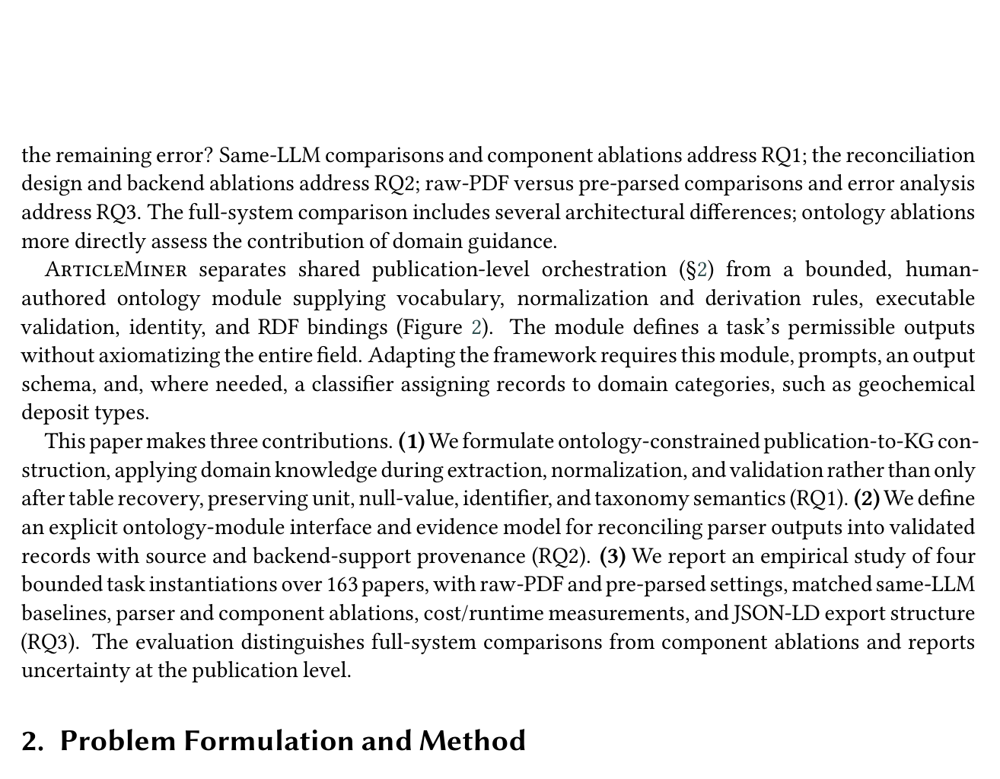

# ArticleMiner: Ontology-Guided Knowledge Graph Construction from Scientific Publications

- arXiv: https://arxiv.org/abs/2609.25607  (v1, submitted 2026-09-22, updated 2026-09-22)
- Authors: Md Abrar Jahin, Craig A. Knoblock, Jay Pujara
- Categories: cs.AI
- Collected: 2026-10-06 (KST)

## Abstract

Scientific papers keep much of their quantitative content in tables and supplementary files, where a number means something only through its header, caption, unit, analytical method, and the conventions of its field. Recovering the rows and columns of a table is therefore not the same as recovering the scientific fact it reports. Most semantic table-interpretation methods assume that a clean table is already available and subsequently map its cells or columns to ontology terms, whereas most publication-level extraction systems are designed for a single domain. We study a middle path: a shared process that reads a paper and its supplementary files, gathers evidence from several parsers and a language model, and reconciles that evidence, while a bounded human-authored task module for each task supplies the domain meaning. The module lists the canonical names the graph may use, the surface forms that map to them, a small set of derivation rules and validity constraints, an identity key, and the bindings used to write RDF. It defines what a task is allowed to emit; it does not try to list every convention of a field. We build four such modules (for drug-discovery chemistry, materials science, machine learning, and mineral geochemistry) in the ArticleMiner framework, and evaluate them on 163 papers, including a new geochemistry benchmark with expert-curated ground truth. In comparisons against a same-LLM few-shot baseline, the point estimates favor ArticleMiner on all four tasks, with uncertainty on the two smaller benchmarks. The geochemistry comparison also includes access to supplementary files, so its improvement cannot be attributed to domain guidance alone.

## Figure 1

Figure 1 summarizes the five stages: parse, extract, self-correct, reconcile, and serialize. Sections 2.1
and 2.3 define the shared interface and orchestration; §2.2 instantiates the module for geochemistry.
Each task supplies a module, prompts, a row schema, and an optional classifier. The four instantiations
are GeoChem (mineral geochemistry), ChemTables (drug-discovery chemistry), DiSCoMaT (materials
science), and MLTables (machine learning).
