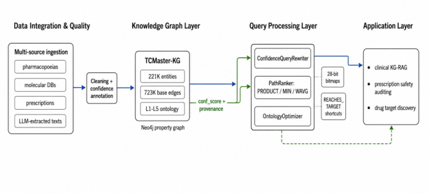

# TCMaster: Confidence-Aware Querying and Workload-Guided Physical Design for Multi-Source Traditional Chinese Medicine Knowledge Graphs

- arXiv: https://arxiv.org/abs/2609.25712  (v1, submitted 2026-09-22, updated 2026-09-22)
- Authors: Zheng Chen, Yuzhu Li, Haoxuan Li, Zhongde Zhang, Lianshun Jin, Peiwu Qin
- Categories: cs.AI
- Collected: 2026-10-06 (KST)

## Abstract

Multi-source knowledge graphs (KGs) need query mechanisms that expose reliability and exploit domain structure. This paper presents TCMaster, a property-graph query substrate for confidence-aware traversal and workload-guided physical design over Traditional Chinese Medicine KGs. TCMaster integrates pharmacopoeias, prescriptions, molecular databases, and LLM-extracted micro-semantics into a KG with approximately 221K entities and 723K base edges. It annotates edges with provenance-level confidence, rewrites Cypher queries with confidence predicates, ranks multi-hop paths under PRODUCT, MIN, or weighted-average policies, and uses ontology skew through direction selection, herb-attribute bitmaps, and materialized shortcut edges. On Neo4j, direction selection improves attribute lookup by a factor of 1.47, shortcuts accelerate high-fanout target counting by a factor of 4.42, confidence filtering removes 39.3 percent of low-quality heterogeneous paths, and KG retrieval improves TCMbench QA accuracy by 20.0 percentage points.

## Figure 1

Fig. 1.
TCMaster system architecture from data ingestion and cleaning to
confidence-annotated Neo4j storage, workload-guided query processing, and
downstream application modes.
