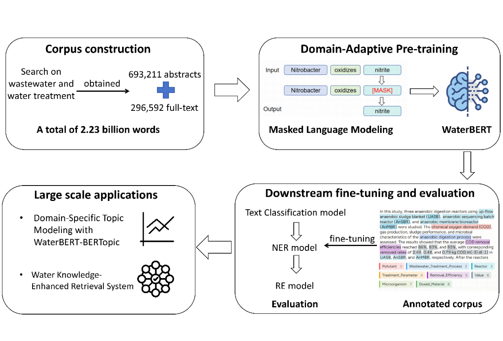

# Domain-Adaptive Pretraining Enhances Water Treatment Semantic Representation for Large-Scale Structured Literature Mining

- arXiv: https://arxiv.org/abs/2609.26034  (v1, submitted 2026-09-22, updated 2026-09-22)
- Authors: Mudi Zhai, Ruihong Qiu, Qingyun Zeng, T. David Waite, Bing-Jie Ni, Haoran Duan
- Categories: cs.CL
- Collected: 2026-10-06 (KST)

## Abstract

Water treatment research is expanding rapidly, but much of the knowledge acquired from this research remains scattered across unstructured literature. The field still lacks a dedicated language model that can efficiently capture water treatment-specific domain semantics for large-scale literature mining. Here, we address this by developing WaterBERT, a domain-adapted encoder model designed for semantic representation and structured information extraction from water treatment texts. WaterBERT was developed by continual pretraining on a large-scale water treatment corpus comprising about 2.97 billion tokens. Three fine-tuned models based on WaterBERT were systematically evaluated on downstream tasks, achieving the best overall performance among general-purpose and domain-specific BERT models, with F1 scores of 90.12% for multiclass treatment process classification, 79.50% for named entity recognition, and 74.04% for relation extraction. Beyond these benchmark tasks, we further demonstrated WaterBERT's advantages for large-scale literature processing. Applied to 5,144 Environmental Science & Technology articles, WaterBERT-BERTopic identified coherent, diverse, and domain-specific research topics without predefined categories. Building on WaterBERT, we processed 693,211 abstracts at substantially lower cost than commercial LLMs while retaining competitive extraction performance to construct a structured water treatment knowledge graph. The knowledge graph was then integrated with lexical and dense retrieval to develop a Water Knowledge-Enhanced Retrieval System (WaterKERS), which achieved a relevance score of 77.7, substantially outperforming text-based retrieval baselines (54.7-64.5). Through WaterBERT, this study provides a compact and scalable semantic foundation for large-scale information processing and evidence mapping in water treatment research.

## Figure 1

Figure 1: Overall workflow of WaterBERT. A domain-specific corpus was constructed from water
treatment literature and used for masked language model pretraining. WaterBERT was then
fine-tuned for text classification, named entity recognition, and relation extraction, and applied
to large-scale literature for topic analysis and structured knowledge graph construction.
