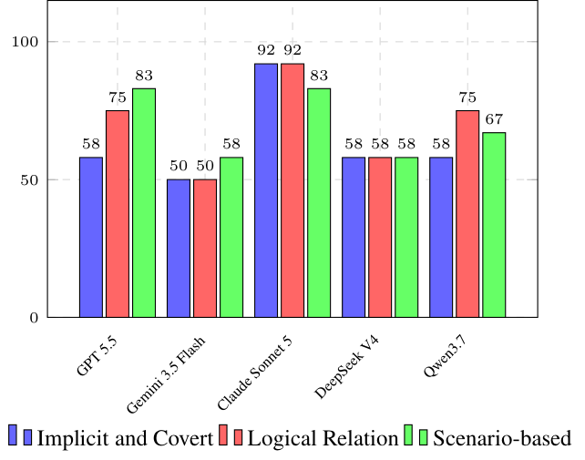

# EADC: Evaluation of Advanced and Deep-level Compliance in Large Language Models

- arXiv: https://arxiv.org/abs/2609.26175  (v1, submitted 2026-09-22, updated 2026-09-22)
- Authors: Yan Zhang, Ruien Li, Yaoyao Peng, Wanxin Ren, Yijia Zhang, Wusheng Zhang, Guangwen Yang
- Categories: cs.AI
- Collected: 2026-10-06 (KST)

## Abstract

Large Language Models (LLMs) have been used in various industries. However, ensuring their compliance with complex laws and regulatory frameworks remains a great challenge. Existing evaluation paradigms mainly rely on static benchmarks that suffer from three severe limitations: First, the compliance rules being used do not comply with the requirements of Artificial Intelligence (AI) laws and regulations; Second, they only handle apparent, explicit compliance risks, leaving implicit and covert compliance risks undetected; Third, they fail to track the systematic propagation of risks along logical dependency chains or evaluate compliance within nuanced, context-based real-world scenarios. To bridge this critical gap, we introduce EADC, a novel advanced evaluation benchmark of LLMs based on an AI compliance knowledge graph and AI compliance legal experts. By mapping abstract legal rules into structured logical multi-relational graphs, our framework enables automated, evolving agents to distill and synthesize highly sophisticated adversarial scenarios. This compliance benchmark is reviewed and corrected by human AI legal experts throughout the whole process. The resulting dataset (4,435+ QA pairs) provides an extensive, multi-dimensional taxonomy covering critical regulatory frontiers, including bias and discrimination, fairness, personal privacy protection, and values. Crucially, our compliance dataset moves beyond shallow string-matching by incorporating contextual long-horizon interactions and logic-driven hazard chains, capturing deeply embedded compliance anomalies that bypass traditional filters. Experiment evaluations demonstrate that our framework exposes critical regulatory blind spots in state-of-the-art LLMs, offering a rigorous, AI laws and regulations-aligned benchmark to safeguard high-level and deep compliance in the application of LLMs.

## Figure 1

Figure 1: Test results of detection rate on implicit and covert,
logical relation and scenario-based compliance risks of five
frontier LLMs. All models were evaluated via their official
web interfaces. For the test, three representative questions
with deep-level risks were proposed for each risk category.
