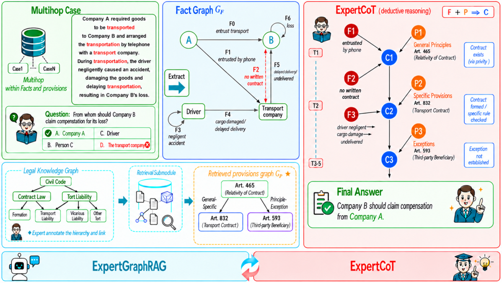

# LEGO: Synergizing Expert GraphRAG and Expert Chain-of-Thought for Legal Reasoning

- arXiv: https://arxiv.org/abs/2609.27009  (v1, submitted 2026-09-22, updated 2026-09-22)
- Authors: Qingjing Chen, Junkai Zhang, Shaochun Wang, Jiahao Ding, Siyuan Zheng, Yukun Yan, Zhi Zheng, Antonino Rotolo, Yun Liu, Weixing Shen
- Categories: cs.CL, cs.IR
- Collected: 2026-10-06 (KST)

## Abstract

Large language models are increasingly applied to high-risk domains such as law, yet complex legal reasoning remains limited by two structural challenges. First, existing RAG and GraphRAG methods emphasize lexical or semantic similarity while overlooking normative relations among legal provisions. Second, vanilla Chain-of-Thought prompting may generate plausible rationales without enforcing the normative structure of legal reasoning. To deal with the bottleneck of pipelines in the legal reasoning domain, we propose LEGO, a dual-module framework that synergizes Legal Expert GraphRAG and expert Chain-of-thought for complex legal reasoning. ExpertGraphRAG uses an expert-annotated civil code graph encoding these normative relations with a greedy normative-coverage retrieval algorithm to dynamically extract instance-specific provision subgraphs, while ExpertCoT organizes the retrieved provisions and case facts into structured Provision-Fact-Conclusion reasoning. With a Qwen3-8B backbone, LEGO achieves 40.53% exact-match accuracy on LawExamQA_Civil, outperforming the evaluated RAG and CoT baselines and performing comparably to the evaluated larger models, while remaining robust on multi-hop questions. It also achieves the best results among the evaluated baselines on the open-ended benchmarks. Ablation studies confirm the individual and complementary contributions of both modules, demonstrating LEGO's effectiveness in improving LLMs' complex legal reasoning ability. Code and dataset can be found in the link: https://github.com/BLK-WHT/LEGO

## Figure 1

Figure 1: LEGO’s architecture. ExpertGraphRAG uses the fact-side instance representation, implemented as a
natural-language query containing the case facts, question, and options to retrieve an instance-specific provision
subgraph from the static Expert Provision Graph. ExpertCoT then composes the retrieved provisions and case
facts into a structured P–F–C analysis. “Fact Graph” and “Conclusion Graph” in the figure denote conceptual
representations rather than separately materialized graph objects.
