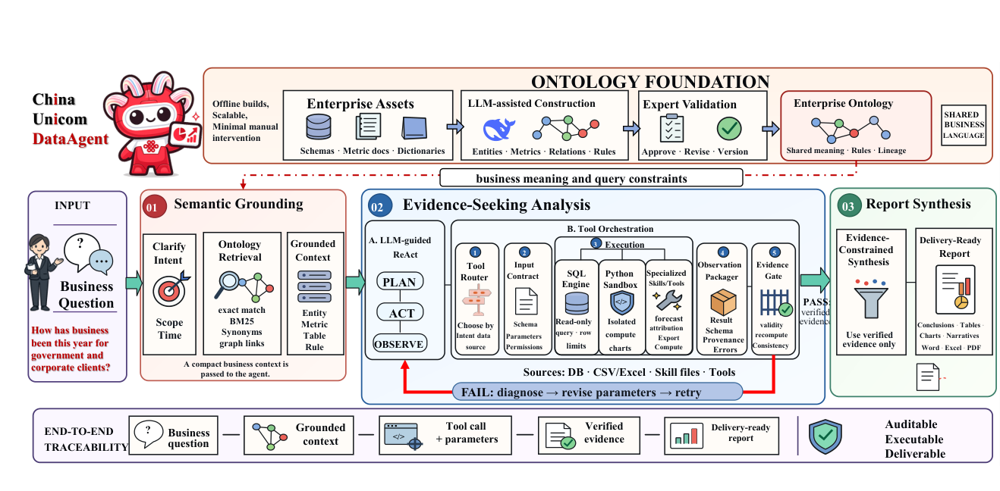

# UniDataAgent: An Ontology-Grounded Agent for Enterprise Question-to-Report Automation

- arXiv: https://arxiv.org/abs/2609.27257  (v1, submitted 2026-09-23, updated 2026-09-23)
- Authors: Yutai Duan, Yahui Zhao, Zhangti Li, Yu Ma, Zhenfeng Qi, Shaoyang Yuan, Jing Fan, Jie Liu
- Categories: cs.CL
- Collected: 2026-10-06 (KST)

## Abstract

Enterprise data agents must preserve organization specific semantics, not just translate questions into queries. We present ChinaUnicom DataAgent (UniDataAgent), an ontology grounded system for reusable question-to-report analysis that separates semantic acquisition from online execution. Ontology Acquisition and Validation stage (OAV) builds versioned enterprise ontologies from metadata, business knowledge, and supporting materials through expert authored business skills, constrained generation, question verification, and selected expert review. Question-to-Report Execution (QRE) stage retrieves semantic contracts for each question, coordinates skills and data tools, validates results, and produces evidence linked reports. Across 27 enterprise tables and roughly thousands of metric types, ontology construction took a few hours instead of about one week manually. It took just a few minutes to generate the reports, instead of several working days. Ontology grounding achieved 95.0\% strict accuracy on real business questions, versus 72.5\% for document RAG, especially on structured and compositional tasks. The system has already been deployed to generate cost savings and has the potential to be replicated in other enterprises.

## Figure 1

Fig. 1.
Overview of UniDataAgent. The previously defined OAV stage constructs and publishes a reusable ontology contract; the QRE stage repeatedly
consumes question-specific ontology context, expert-defined analytical Skills, and executable evidence to produce delivery-ready reports.
