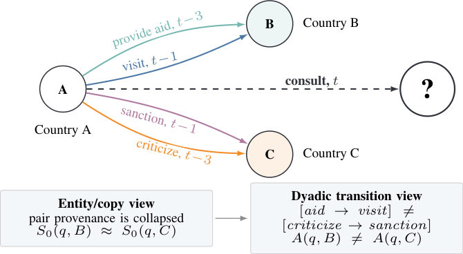

# BridgeMem: Causal Dyadic Transition Residuals for Temporal Knowledge Graph Forecasting

- arXiv: https://arxiv.org/abs/2609.29268  (v1, submitted 2026-09-24, updated 2026-09-24)
- Authors: Zeyan Li, Libing Chen, Shengda Zhuo, Yin Tang, Jianfeng Xu
- Categories: cs.LG
- Collected: 2026-10-06 (KST)

## Abstract

Temporal knowledge graph forecasting aims to infer future relational facts from the temporal structure of observed events. Existing forecasters mainly summarize history through entity states, relation states, paths, or exact recurrence. These views often miss pair-specific transition evidence, that is, the way prior relations between the query actor and a candidate change the odds of the target relation. We introduce BridgeMem, which estimates this quantity as a residual added to the log scores of a frozen full-vocabulary forecaster. For each candidate, BridgeMem retrieves the pair's events that strictly precede t, encodes their relations, directions, and lags, and converts them into a likelihood-ratio correction. A support-adaptive empirical-Bayes reader trusts exact transition counts where they are abundant and backs off to a learned attention estimator where they are sparse. The backbone's own uncertainty gates the correction, so confident queries and candidates without dyadic history are left unchanged. On five benchmarks, BridgeMem improves on the strongest of nine baselines from 2021--2026 in all 20 filtered MRR and Hits@{1,3,10} comparisons, with MRR gains of 0.0213, 0.0164, 0.0216, 0.0112, and 0.0028 over the best prior result. These results show the value of explicit dyadic transition modeling.

## Figure 1

Fig. 1. The resolution mismatch. Entity/copy views collapse the
queried actor–candidate dyad, while typed dyadic histories preserve
distinct transition evidence.
