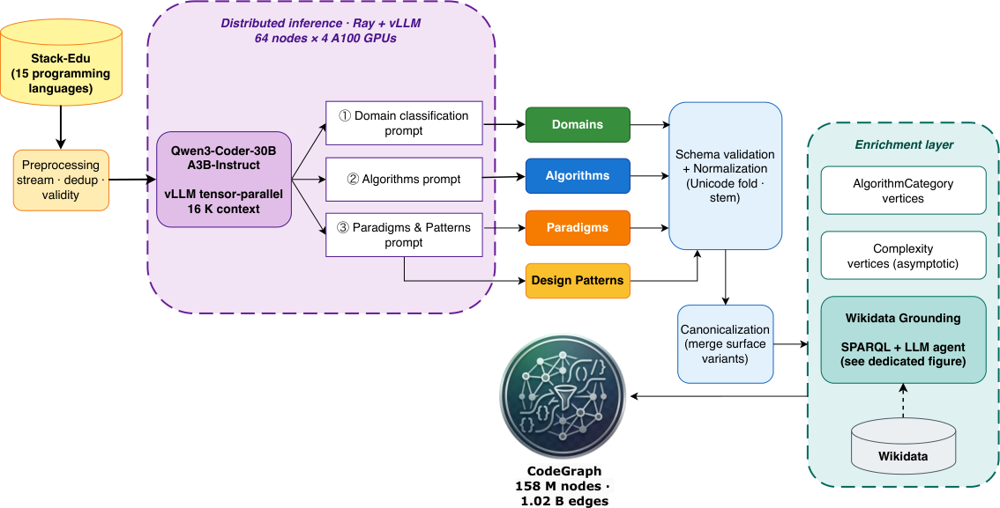

# CodeGraph: Open-Taxonomy Knowledge Graph for Source Code with Wikidata Grounding

- arXiv: https://arxiv.org/abs/2609.29474  (v1, submitted 2026-09-24, updated 2026-09-24)
- Authors: Federico Pennino, Andrea Gurioli, Stefano Zacchiroli, Maurizio Gabbrielli, Paolo Ferragina
- Categories: cs.SE, cs.CL, cs.IR
- Collected: 2026-10-06 (KST)

## Abstract

Public software repositories, like GitHub and Software Heritage Archive, store billions of files, yet extracting their implicit engineering knowledge ---i.e., the algorithms they implement, the paradigms they follow, the patterns they instantiate, and the application domains they serve--- remains challenging, as current tools are constrained to syntactic and token-level analysis. We present a pipeline for building an open-taxonomy semantic annotation of source code using a code-specialised Large Language Model. The extracted entities are grounded in Wikidata through a three-stage linking procedure: a deterministic SPARQL stage handles unambiguous entities, a Deep Research Agent resolves the residual long tail, and a hierarchy-rollup stage imports the parent-of closure of each resolved Wikidata identifier. The resulting annotations are materialised as a source-code-specific open-taxonomy knowledge graph. We further introduce a calibrated quality-assurance protocol that quantifies annotation precision by combining a small human gold set with an LLM-as-a-judge filter. We applied our pipeline to the 167 million files of the Stack-Edu corpus, creating the first known large-scale open-taxonomy knowledge graph for source code. Our graph, named CodeGraph, contains approximately 158 million nodes, which include around 145 million files, about 63,000 extracted concept entities (such as algorithms, paradigms, design patterns, and application domains), and roughly 19,800 grounded Wikidata entities. Furthermore, CodeGraph features approximately 1 billion typed edges that connect files to their respective concepts, link these concepts to their grounded Wikidata identifiers, and relate them to their parent categories, covering 14 programming languages.

## Figure 1

Figure 1: Overview of the CodeGraph methodology. Source files from Stack-Edu are processed through an LLM inference
stage (Qwen3-Coder-30B-A3B-Instruct) that emits four orthogonal categories of semantic annotations: domains, algorithms,
paradigms, and design patterns. Annotations undergo a post-processing stage comprising domain canonicalisation and Wikidata
linking, and are integrated into CodeGraph as a typed property graph that supports semantically grounded queries across both
the local vocabulary and Wikidata.
