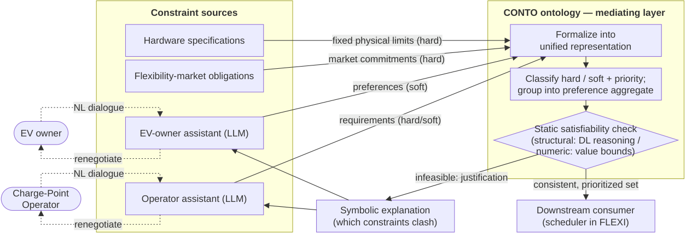

# Ontology-Mediated Neurosymbolic Constraint Acquisition from Multiple Stakeholders

- arXiv: https://arxiv.org/abs/2609.29876  (v1, submitted 2026-09-24, updated 2026-09-24)
- Authors: Stefan Bischof, Juliana Kainz, Danilo Valerio
- Categories: cs.AI
- Collected: 2026-10-06 (KST)

## Abstract

Neurosymbolic research typically assumes a pre-existing symbolic specification, leaving the upstream challenge of acquiring and formalizing requirements and constraints largely unaddressed. We present an architecture that fills this gap by using an OWL configuration ontology to mediate between neural constraint sources and downstream consumers. In this framework, LLM assistants elicit soft stakeholder preferences, while hardware specifications define hard physical and engineering limits. The ontology unifies these heterogeneous inputs, leverages description logic to identify unsatisfiability, and generates symbolic explanations that enable LLMs to interactively renegotiate terms with users. Any remaining conflicts are resolved downstream via priority-based relaxation. We illustrate our approach on a microgrid use case from the FLEXI project and argue its generalizability to multi-stakeholder domains where constraint acquisition is distributed across human and automated sources of unequal authority.

## Figure 1

Figure 1: The constraint-acquisition loop, instantiated on the FLEXI microgrid. Constraint sources of unequal
authority (left) feed the CONTO mediating layer (right), which this paper addresses; the downstream consumer
(a scheduler in FLEXI) is out of scope.
