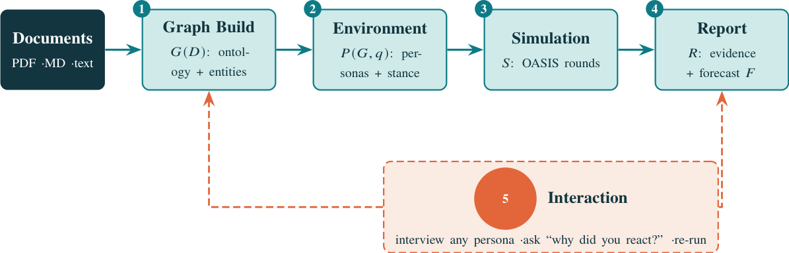

# Augur: A Synthetic Decision Lab for Rehearsing Reactions to Product and Policy Changes

- arXiv: https://arxiv.org/abs/2609.29952  (v1, submitted 2026-09-24, updated 2026-09-24)
- Authors: Rahul Khedar, Mayank Malhotra, Avinash Karn
- Categories: cs.AI, cs.CL, cs.MA
- Collected: 2026-10-06 (KST)

## Abstract

Before a product or policy change ships, the question that matters is how people will react to it. Augur rehearses that reaction offline: it builds a typed knowledge graph from the change documents, populates a grounded persona market, simulates the interaction, and returns an auditable decision memo recommending one of five actions. We assemble Gold-50, fifty real product and policy episodes whose real-world outcome is known, adjudicated against the public record, and score the five-way release verdict against it. Our central finding is methodological and negative: most of the measured gap between frontier cloud models and open-weight models we fine-tune and serve offline is attributable to an under-specified evaluation, not a difference in capability. We show this three ways. First, the prompt envelope alone can dominate the score: holding weights, cases and scorer fixed, one system -- a LoRA-SFT adapter on Qwen3-32B -- swings from 0% to 73%. Second, in a matched 2x2 ablation, defining the decision taxonomy in the prompt -- with no model change -- lifts every frontier model by +24 to +34pp; under the under-specified prompt, Qwen3-32B LoRA-SFT served offline beats all three frontier models (paired McNemar, Holm-corrected), and once the prompt is fair no significant difference from any of them is detected. Third, agreement with the distillation teacher rises without accuracy following, and the full pipeline amplifies a systematic "over-doom" bias rather than improving the verdict. Separately, we validate the reaction layer on its own terms: blind judges across four model families find the synthetic reaction recovers 67-90% of the concerns the public actually raised, and a pre-registered ablation locates its value -- largest where the decision is hardest, redundant near ceiling. The pipeline that regenerates every number and figure here is available from the authors.

## Figure 1

Figure 1. The Augur pipeline; symbols are the operators of Equation (2). Each forward stage persists an inspectable artifact; the interaction
stage feeds findings back into the graph or report.
