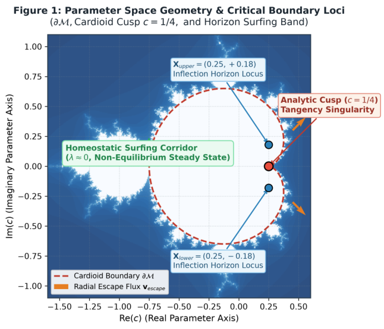

# Orbital Error Dynamics: Self-Organized Criticality, Ephemeral Parameter Resonance, and Non-Linear Biological Ontologies in Zero-Storage Neural Synthesis

- arXiv: https://arxiv.org/abs/2609.30115  (v1, submitted 2026-09-24, updated 2026-09-24)
- Authors: Volkan Dağlı, Zerrin Dağlı, Dağhan Dağlı
- Categories: cs.NE, cs.LG, nlin.CD
- Collected: 2026-10-06 (KST)

## Abstract

Modern deep neural networks treat parameters as static floating-point matrices stored in physical memory, incurring Von Neumann memory bottlenecks and representation collapse. We formulate Orbital Error Dynamics (OED), an analytical framework wherein synaptic weights are not stored masses (O(W)), but transient topological resonances (O(1)) derived procedurally from the complex quadratic polynomial map z_{n+1} = z_n^2 + c. We introduce the Bent Sine Wave Hypothesis, demonstrating that non-equilibrium living systems emerge when harmonic waves curl inward through environmental drag toward the cardioid cusp (c = 1/4). We define the Observer Horizon Geometry in parameter space, identifying interior resonance shoulder loci X_upper = (0.25, +0.18) and X_lower = (0.25, -0.18) between the fixed-point basin and the true boundary at c = 0.25 +/- 0.50i. To escape non-convex stagnation without loss zeroing, we introduce a heavy-tailed Biomimetic Perturbed Jump Operator (Omega_tunneling) inspired by mammalian fertilization zinc sparks. We further couple an enteric-cranial Dual-Brain architecture shielded by adaptive CD4+ regulatory immune gating (M_CD4), and project the 4-nucleotide genetic basis (A, T, C, G) across quadrants in C. Multi-seed empirical validation on the Two-Moons manifold (5 seeds, 80/20 train/test split, 32x32 grid, zero test-time updates, zero label leakage) demonstrates that procedural parameterization from a 24-byte coordinate seed achieves 77.67% +/- 5.35% clean test accuracy (within an 8.00-point paired difference of an unconstrained gradient baseline at 85.67% +/- 5.35%, 95% CI: [-1.07%, 17.07%]) and 71.33% +/- 3.80% under distribution shift (N(1.2, 0.4)), alongside conceptual equivalence with an analog optical co-processor.

## Figure 1

Figure 1: Parameter Space Geometry & Critical Loci
(Schematic Topological Illustration):
Main cardioid
boundary ∂M, analytic cusp singularity at c = 1/4,
true boundary loci at (0.25, ±0.50i), sub-boundary in-
terior resonance shoulder loci Xupper = (0.25, +0.18) and
Xlower = (0.25, −0.18), radial escape fluxes vescape, and
homeostatic surfing corridor (λz ≈0).
