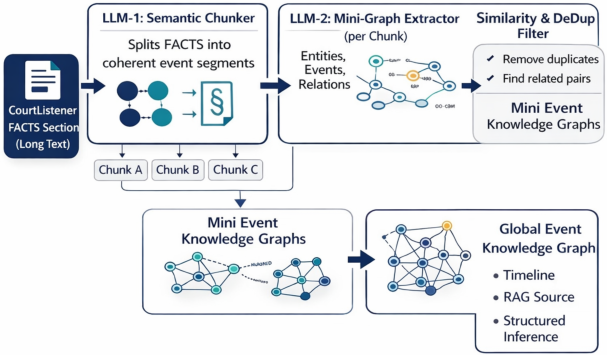

# ARGUS: Role-Aware Event Knowledge Graphs for U.S. Employment-Discrimination Complaints

- arXiv: https://arxiv.org/abs/2609.30184  (v1, submitted 2026-09-24, updated 2026-09-24)
- Authors: Sriram Kannan, Swetha Saseendran, Vishnu Vardhan Reddy Kandi, Leslie Barrett, Madhavan Seshadri, Enrico Santus
- Categories: cs.CL
- Collected: 2026-10-06 (KST)

## Abstract

U.S. employment-discrimination complaints describe complex event sequences that are not explicitly captured by lexical or embedding-based representations alone. We present ARGUS, a source-grounded pipeline that combines a 5W1H-inspired schema, legal-domain models, and LLM-based structured generation to construct document-level Event Knowledge Graphs (EKGs) from CourtListener complaints. ARGUS extracts fact-bearing statements, builds chunk-level event graphs with participant, temporal, and causal structure, and merges them into document-level representations. We evaluate graph quality through human and multi-model assessment and test downstream utility on claim classification and legal QA. The graph-structured classifier outperforms raw and linearized baselines on the held-out set, and EKG-only retrieval improves document-scoped QA, while open-retrieval gains remain limited by low first-stage candidate recall. These results suggest that EKGs are most useful for organizing and reasoning over evidence once relevant material has been retrieved.

## Figure 1

Figure 1: Multi-stage pipeline for EKG construction
from federal employment-discrimination complaint nar-
ratives.
