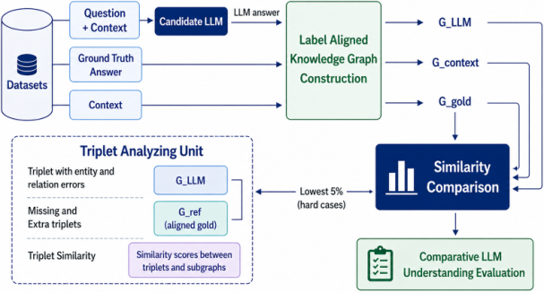

# Do LLMs Understand Context? A Knowledge Graph-Based Evaluation Framework

- arXiv: https://arxiv.org/abs/2609.30484  (v1, submitted 2026-09-24, updated 2026-09-24)
- Authors: Subavarshana Arumugam, Mamta Nallaretnam, Kithuni Wickramasinghe, Chamath Gunapala, Pragatheeswaran Vipulanandan, Kamal Premaratne, Uthayasanker Thayasivam
- Categories: cs.AI, cs.LG
- Collected: 2026-10-06 (KST)

## Abstract

While large language models (LLMs) have achieved remarkable linguistic capabilities, a profound question lingers at their core: do these models truly comprehend context or simply excel at pattern matching on an unprecedented scale? Contextual understanding in LLMs refers to the ability to correctly extract relevant information from a given context, integrate it into a coherent internal representation, and reason over it to produce factually consistent and contextually grounded responses. However, traditional methods such as BiLingual Evaluation Understudy (BLEU) and perplexity simply measure surface-level performance. This reveals a critical gap in question answering (QA), where responses must be contextually grounded rather than simply being memorized associations. To fill this void, we propose a novel knowledge graph (KG) based evaluation framework for LLM contextual understanding in QA. Central to this is Semantic Structural Similarity for KGs (S3KG), a hybrid similarity measure combining structural and semantic signals into a single score. In addition, a diagnostic analysis framework is developed to identify and categorize reasoning errors at the triplet level, enabling fine-grained analysis of model failures. Together, across nine benchmarks, S3KG achieves F1 gains of up to $+7.6$ points over the strongest baseline and AUROC up to $0.973$.

## Figure 1

Figure 1: Methodology pipeline for LLM comparison
and evaluation.
