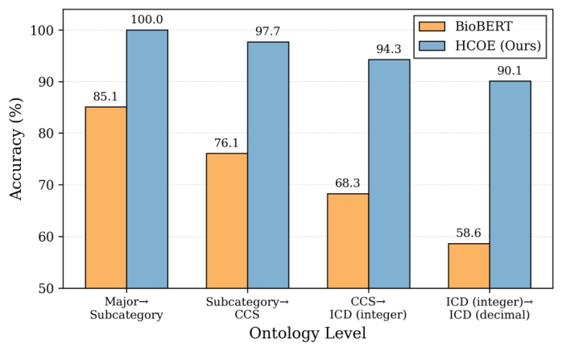

# HCOE: Hyperbolic Clinical Ontology Embeddings from Biomedical Language Models

- arXiv: https://arxiv.org/abs/2609.30763  (v1, submitted 2026-09-25, updated 2026-09-25)
- Authors: Yixuan Li, Weihao Li, Ziyang Song
- Categories: cs.AI, cs.LG
- Collected: 2026-10-06 (KST)

## Abstract

Biomedical language models (LMs) encode textual semantics but do not explicitly preserve medical code hierarchies. We present Hyperbolic Clinical Ontology Embeddings (HCOE) for hierarchy-aware clinical concept representation. HCOE maps frozen BioBERT embeddings into a Poincare ball, combining parent-side and child-side ontology-guided contrastive learning with coarse-to-fine ontology-path aggregation. It uses International Classification of Diseases (ICD) codes organized by Clinical Classifications Software (CCS) and Anatomical Therapeutic Chemical (ATC) medication hierarchies. Evaluations show that HCOE performs best on ICD/ATC clinical relation prediction and CCS-to-PheCode hierarchy transfer. On the MIMIC-IV dataset, HCOE also achieves the best performance on mortality prediction, readmission prediction, medication recommendation, and rare drug prediction.

## Figure 1

Fig. 1. Comparison of 1-hop parent–child relation prediction in the ICD
hierarchy. We assess whether BioBERT and HCOE embed each child concept
closer to its true parent than to unrelated concepts across five levels. HCOE
consistently outperforms BioBERT, with larger gains at finer-grained levels.
