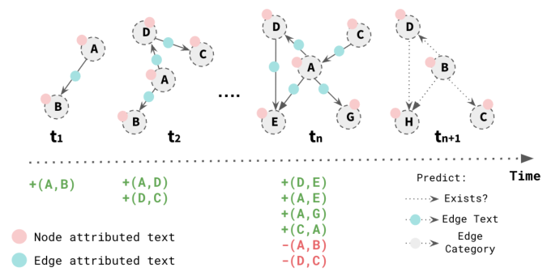

# TemporalGraphLLM: Temporal Graph Neural Networks with Large Language Models for Dynamic Text-Attributed Graphs

- arXiv: https://arxiv.org/abs/2609.31881  (v1, submitted 2026-09-25, updated 2026-09-25)
- Authors: Moran Beladev, Or Eitan, Gilad Katz, Lior Rokach
- Categories: cs.LG
- Collected: 2026-10-06 (KST)

## Abstract

Dynamic text-attributed graphs (DTAGs), where nodes, edges, and textual attributes evolve over time, are crucial in applications such as social networks, citation graphs, and knowledge graphs. However, existing approaches struggle to jointly model the temporal evolution of graph structures and the semantic richness of textual attributes. While Temporal Graph Neural Networks (TGNNs) capture evolving node relationships, they often lack contextual text reasoning. Conversely, Large Language Models (LLMs) excel in textual understanding but struggle with structured graph reasoning in temporal settings. To bridge this gap, we propose TemporalGraphLLM, a novel framework that can integrate any temporal GNN with an LLM for enhanced reasoning in DTAGs. Our approach fine-tunes LLMs using graph-time-aware instruction tuning and novel temporal GNNs injection to replace dedicated added tokens with graph embeddings. TemporalGraphLLM effectively leverages pretrained TGNNs within an LLM framework to achieve state-of-the-art performance on edge classification, link prediction, and edge-based text generation tasks. Extensive evaluation on real-world dynamic graph datasets demonstrates state-of-the-art performance. Our findings highlight the synergistic potential of LLMs and TGNNs, opening new directions for learning on evolving graphs.

## Figure 1

Figure 1. A Dynamic Text-Attributed Graph (DTAG) example,
where nodes and edges evolve over time with textual attributes. Our
work aims to enhance predictive capabilities over such a structure.
