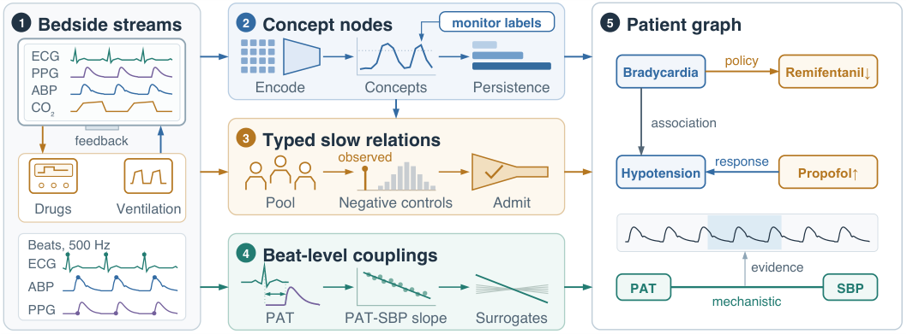

# Feedback-Robust AI for Patient Knowledge Graphs

- arXiv: https://arxiv.org/abs/2609.33248  (v1, submitted 2026-09-27, updated 2026-09-27)
- Authors: Mohammed Sameer Syed
- Categories: cs.LG
- Collected: 2026-10-06 (KST)

## Abstract

Patient knowledge graphs from bedside monitoring should type their relations and state whether the data support their signs. In anesthesia and intensive care, clinicians titrate drugs and ventilation in response to the physiology, so temporal relations mix the patient's response with the clinician's policy. We introduce ClosedLoopBench: 29 relations with signs fixed by physics, pharmacology or clinical practice, on 3,442 VitalDB surgical cases (12,653 h) with negative-control action streams. When each patient's actions are replaced by another patient's, six of 12 estimators declare on average 11-18 of their 19-29 distinct relation estimates significant without calibration, and after calibration cross-correlation and Granger tests still assign ventilator rate -> end-tidal CO2 the sign of the clinician's policy. We propose feedback-robust patient graphs that combine concept nodes with evidence pointers, typed relations admitted against negative controls, and beat-level couplings. On VitalDB under null streams, our graphs contain 0.06-0.10 false concept-level relation instances per graph, versus 10-12 for correlational construction. Patient-specific estimates of 11 slow drug and ventilator responses predict later data no better than population estimates, whereas the pulse-arrival-time-systolic-pressure slope is negative in 94.3% of 2,884 cases and patient-specific (early-late correlation 0.67 [0.63, 0.70]).

## Figure 1

Figure 1: Overview. Bedside streams (1), where clinicians titrate drugs and ventilation on the vitals,
yield concept nodes (2), typed slow relations admitted against negative controls (3) and surrogate-
tested beat-level couplings (4), which form a patient graph with evidence pointers (5).
