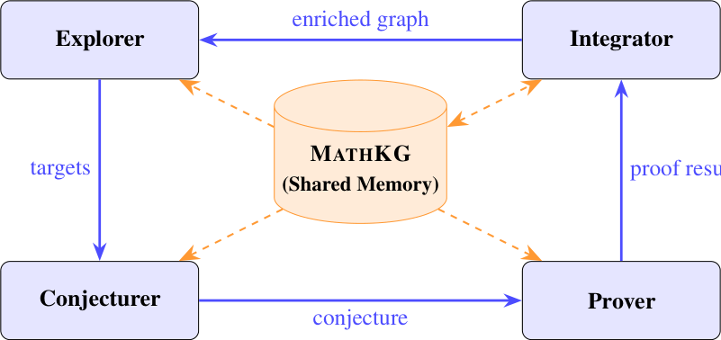

# When Does Structured Knowledge Help Neural Theorem Proving?

- arXiv: https://arxiv.org/abs/2609.34460  (v1, submitted 2026-09-28, updated 2026-09-28)
- Authors: Sareh Nabi, Roland Vogl, Marzieh Nabi
- Categories: cs.AI, cs.LG, cs.LO
- Collected: 2026-10-06 (KST)

## Abstract

Does structured mathematical knowledge help LLMs prove theorems in Lean 4? If so, for which models, and does the answer vary by problem? Formal libraries such as Mathlib encode 285,000+ verified theorems with syntactic dependencies, but the semantic layer mathematicians rely on for discovery (analogies, generalizations, cross-domain bridges) remains implicit. We introduce MathAgent, which builds this layer as a knowledge graph, MathKG, and uses it to augment LLM theorem provers. MathKG connects 364 Mathlib theorems and definitions by 9,434 typed semantic edges inferred via LLM-based relation extraction anchored to verified Mathlib declarations. We run a controlled ablation across four augmentation modes (no context, knowledge-graph context, Mathlib retrieval, both) and five models: Qwen3-8B/32B, their Lean-specialized derivatives Goedel-Prover-V2-8B/32B, and Claude Sonnet 4.6, on miniF2F, plus PutnamBench and MathOlympiadBench for Sonnet. Three findings emerge. (i) Specialization dominates augmentation: Lean fine-tuning adds 33-38 percentage points of solve rate in every mode, and a specialized 8B model beats a $4\times$ larger general one by 29-35 points, while no augmentation mode improves solve rate by more than 3 points. (ii) Augmentation is capability-conditioned: knowledge-graph context helps small models but hurts large ones, with the specialized model gaining more relative to its general base at every scale. (iii) Yet the augmentation modes solve different problems: an oracle selecting the best mode per problem solves 6% to 58% more than the unaugmented prover, a complementarity effect that strengthens on harder problems (32% more on PutnamBench). These results motivate adaptive strategies that select augmentation by model capability and problem. Code, data, and artifacts are available at https://github.com/sarehnabi/mathagent

## Figure 1

Figure 1: The MATHAGENT architecture: four LLM agents with MATHKG as persistent shared
memory (the Orchestrator, which coordinates the cycle, is omitted).
