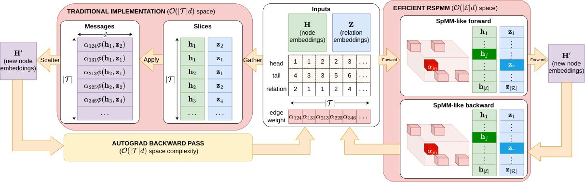

# Scalable GNN-based Knowledge Graph Representation Learning with Efficient Message Passing

- arXiv: https://arxiv.org/abs/2609.34499  (v1, submitted 2026-09-28, updated 2026-09-28)
- Authors: Huu Tan Mai, Cuong Xuan Chu, Heiko Paulheim, Daria Stepanova
- Categories: cs.LG, cs.AI
- Collected: 2026-10-06 (KST)

## Abstract

Graph neural networks (GNNs) excel at representation learning on Knowledge Graphs (KGs), achieving stateof-the-art performance on tasks like link prediction or entity classification. However, their high computational complexity, inherent to their user-defined message passing (MP) algorithm, still prohibits their widespread adoption, especially for large KGs. Current efforts to mitigate the scalability bottlenecks of GNNs on KGs, such as subgraph sampling, are often task- and model-specific, and do not reliably guarantee lossless (if applicable) runtime/space reductions. To address this, we extend Relational Sparse Matrix Multiplication (RSPMM), originally designed to losslessly lower the space complexity of composition-based MP with pointwise composition functions, to support more expressive functions (e.g., 2x2 block-diagonal matrix multiplication, Givens rotation, circular correlation). Our method delivers significant task-independent reductions in runtime and space for current GNNs on KGs and facilitates efficient re-implementations of GNNs that maintain near state-of-the-art performance on challenging KG tasks, for a fraction of computational costs.

## Figure 1

Figure 1: Example of traditional implementations of composition-based MP (left), against efficient RSPMM𝜑
implementations (right). The latter aim to fuse all operations in lower space complexity, as in practice, |ℰ| ≪|𝒯|.
