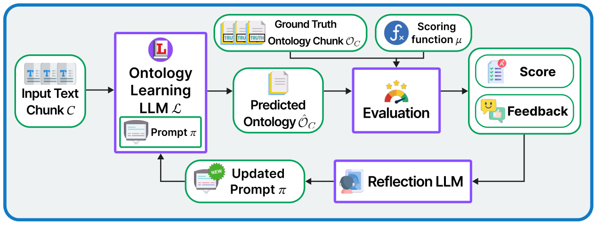

# APOLO: Automatic Prompt Optimization for Ontology Learning

- arXiv: https://arxiv.org/abs/2609.34540  (v1, submitted 2026-09-28, updated 2026-09-28)
- Authors: Huu Tan Mai, Roman Kochnev, Cuong Xuan Chu, Lukas Lange, Heiko Paulheim, Daria Stepanova
- Categories: cs.AI
- Collected: 2026-10-06 (KST)

## Abstract

Ontology Learning (OL) from text has advanced with the emergence of Large Language Models (LLMs), but it remains challenging due to the limited availability of annotated training data and the difficulty of adapting LLMs to perform OL effectively. We address this via APOLO - Automatic Prompt Optimization for Ontology Learning, by casting OL as an explicit prompt optimization problem over LLM modules. To obtain training data, we employ a multi-agent system that generates text-ontology pairs from existing expert-curated ontologies. We then propose two ontology learner architectures: a greedy and an autoregressive learner, and optimize both using GEPA, a greedy evolutionary prompt optimizer built on DSPy. Experiments on two ontologies - a biomedical (DOID) and a plant ontology (PO) show consistent improvements after optimization across nearly all model and mode combinations, with autoregressive learners achieving the largest gains. Our results demonstrate that prompt optimization is a viable and lightweight alternative to fine-tuning for OL, and that the autoregressive formulation better captures ontological structure than the greedy approach.

## Figure 1

Figure 1: Overview of APOLO’s prompt optimization framework. An ontology learner predicts an ontology
from an input text chunk using prompt 𝜋. The prediction is evaluated against a ground-truth ontology chunk to
produce a score and actionable feedback; a reflection LLM uses both to iteratively improve 𝜋while keeping the
underlying LLM fixed.
