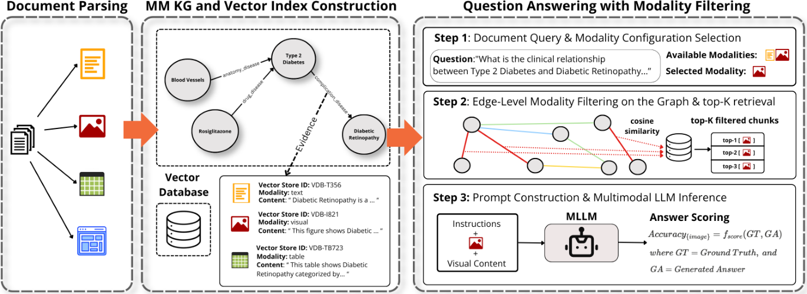

# Signal or Noise? Modality Contribution and Cooperation in Multimodal GraphRAG

- arXiv: https://arxiv.org/abs/2609.35304  (v1, submitted 2026-09-28, updated 2026-09-28)
- Authors: Antonios Georgakopoulos, Paul Groth, Lise Stork
- Categories: cs.IR
- Collected: 2026-10-06 (KST)

## Abstract

Multimodal knowledge graphs (KGs) integrate information from text, figures, tables, and other modalities into a unified structured representation, with the promise that richer evidence enables better inference. In GraphRAG systems built over such graphs, it is commonly assumed that retrieving evidence from more modalities at inference time improves downstream performance. Yet, redundant or overlapping multimodal evidence may distract language models in question answering (QA), and whether each modality contributes equally across questions, models, and tasks remains poorly understood. In this work, we study how modality-aware retrieval affects downstream inference in a multimodal GraphRAG pipeline, using document visual question answering (DocVQA) as a testbed. We extend an existing KG-based QA framework to be modality-aware, leveraging the graph structure to track which modality supports which facts and to selectively filter evidence at the edge level. This enables us to investigate whether providing all available multimodal evidence at inference time benefits QA, and to evaluate the contribution and cooperation of modalities across question, task, and model characteristics. Through a controlled analysis within a state-of-the-art multimodal GraphRAG pipeline, five multimodal LLMs and two DocVQA benchmarks, we find that tables and text provide the strongest contributions, and that combining modalities frequently produces redundancy rather than synergy, particularly for pairs involving textual information. Positive cooperation appears mainly between non-text modalities and depends on question intent and task type. Our findings argue for selective, modality-aware retrieval in the design of more effective GraphRAG systems, where modalities are filtered according to the downstream task rather than retrieved uniformly.

## Figure 1

Figure 1: Overview of our modality-aware multimodal QA framework.
