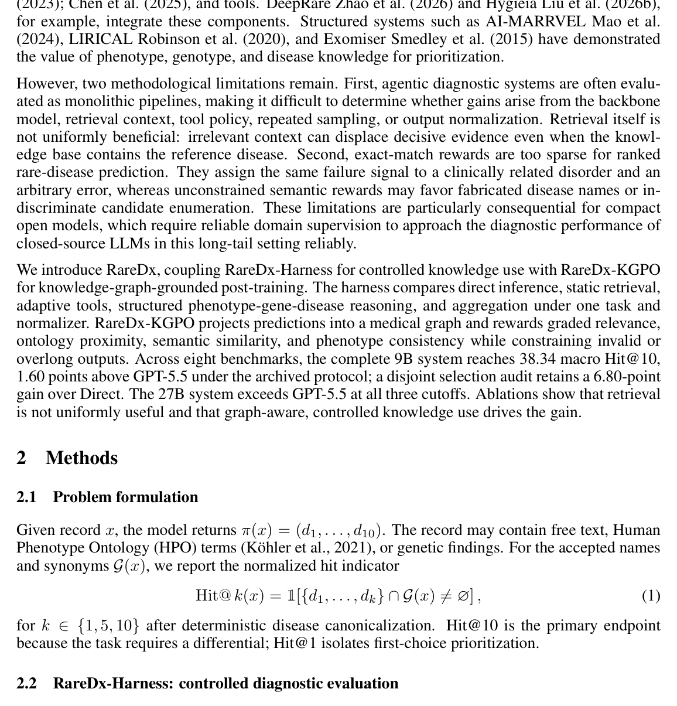

# RareDx: Controlled Knowledge Integration and Graph-Grounded Policy Optimization for Rare-Disease Diagnosis

- arXiv: https://arxiv.org/abs/2609.35549  (v2, submitted 2026-09-28, updated 2026-09-29)
- Authors: Bo Zhang, Yuchen Wang, Dongbai Li, Matthew Yu Heng Wong, Qingkai Zeng, Lijun Wang, Tien-Yin Wong, Peng Cui, Tianyu Liu
- Categories: cs.AI
- Collected: 2026-10-06 (KST)

## Abstract

Rare-disease diagnosis is a long-tail reasoning problem: phenotypes are incomplete, individual disorders are sparsely documented, and relevant evidence is distributed across ontologies, gene annotations, and biomedical text. Language models consequently favor common conditions, miss rare candidates, or produce plausible but invalid names. We introduce RareDx, which couples controlled evidence use with knowledge-graph-grounded policy optimization. RareDx-Harness normalizes heterogeneous records into one ranked-diagnosis task and compares direct inference, static retrieval, adaptive tools, and structured phenotype-gene-disease reasoning over a shared knowledge layer. The training pipeline combines Top-10 post-training with RareDx-KGPO, our knowledge-graph-grounded policy optimization method. Its reward projects predictions into a canonical disease graph and integrates curated graded relevance, ontology proximity, biomedical similarity, and phenotype consistency. Vocabulary and output-budget constraints prevent dense partial credit from rewarding fabricated or overlong differentials. Across eight benchmarks, the complete RareDx system centered on Qwen3.5-9B reaches 38.34 macro Hit@10, 1.60 points above GPT-5.5 under the archived protocol; a disjoint validation-selection audit retains a 6.80-point routing gain over Direct on held-out cases. The 27B system reaches 23.53/36.56/40.76 at Hit@1/5/10. Controlled ablations show that retrieval is not uniformly helpful and that controlled routing is central to the gain. These results indicate that structured medical knowledge can turn a compact model into a competitive diagnostic ranker across heterogeneous long-tail settings in clinical practice.

## Figure 1

Figure 1 summarizes RareDx-Harness, which isolates parametric knowledge, retrieval, tool policy,
and stochastic aggregation. Every strategy consumes the same normalized case and returns the same
Top-10 schema, enabling paired comparison under one judge.
