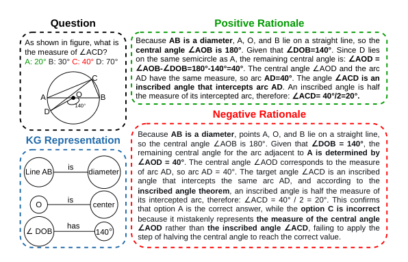

# Question-Specific Knowledge Graphs for Efficient Visual Reasoning

- arXiv: https://arxiv.org/abs/2609.35942  (v1, submitted 2026-09-28, updated 2026-09-28)
- Authors: Ting-Chih Chen, Emile van Krieken, Shujian Yu, Filip Ilievski
- Categories: cs.CL
- Collected: 2026-10-06 (KST)

## Abstract

Recent work in visual question answering has shown that vision-language models can exhibit strong reasoning capabilities by translating visual inputs into textual representations. The effectiveness of this translation depends on how well visual details are retained; models need to surface and align both explicit and implicit knowledge sufficient to support reasoning, without introducing spurious assumptions. Existing methods that leverage detailed image captions introduce visual details unrelated to the reasoning task, inflating input token counts and increasing computational cost. To address these challenges, we propose VisKG, a reinforcement learning (RL) framework in which models learn to translate visual content into question-specific knowledge graph (KG) representations. This process filters out perceptual noise while preserving the entity-relation structure needed for chain-of-thought reasoning, following the principle of minimum sufficient information. To ensure stable RL post-training, VisKG adopts Group reward-Decoupled Normalization Policy Optimization (GDPO). In addition, we strengthen the supervision stage with negative rationale samples, exposing the model to incorrect reasoning paths before RL post-training. Experimental results across science, mathematics, and general visual understanding benchmarks show that VisKG achieves performance comparable to or better than baselines, while requiring fewer tokens than caption-based representations. Moreover, training VisKG with GDPO improves accuracy by 2% over its GRPO-trained counterpart on average. These results suggest that KG representations are a promising approach for supporting multi-step reasoning and open up future work on adaptively selecting the most suitable representation for a given task.

## Figure 1

Figure 1: For a question-image VQA pair, VisKG generates
a KG representation of the relevant visual content. Then, it
produces KG-grounded CoT reasoning, illustrated with both
a positive and a negative rationale.
