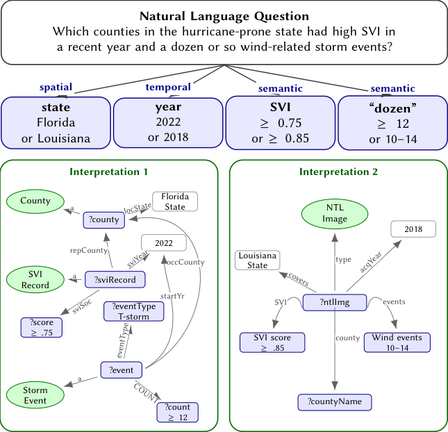

# GeoOutageBench: Benchmarking Ambiguity-aware, Ontology-grounded Geospatiotemporal KGQA for Multimodal Power Outage and Resilience Analysis

- arXiv: https://arxiv.org/abs/2609.36082  (v1, submitted 2026-09-28, updated 2026-09-28)
- Authors: Ethan D. Frakes, Amy Kvien, Rishabh Kundu, Redad Mehdi, Van D. Tran, Vibha S. Mandayam, Kristopher O. Davis, Erika I. Barcelos, Roger H. French, Yinghui Wu, Mengjie Li
- Categories: cs.AI, cs.CL, cs.IR
- Collected: 2026-10-06 (KST)

## Abstract

We introduce GeoOutageBench, a benchmark for assessing LLM-based geospatiotemporal KGQA for multimodal outage and resilience analysis. Unlike existing KGQA benchmarks for Web knowledge, GeoOutageBench considers a spatiotemporal KG that integrates visual, textual, and structured data from outage records, remote sensing, weather observations, storm and power events, geographic entities, and domain ontologies. It provides a competency query taxonomy at different difficulty levels from spatiotemporal containment and proximity, spatiotemporal co-occurrence analysis, multimodal evidence, to hypothetical evaluation. Over multimodal KG and query classes, GeoOutageBench provides user-configurable evaluation of three important, highly coherent yet less studied tasks: (1) LLMs' understanding for ambiguous geospatiotemporal questions in terms of NL to SPARQL interpretation, (2) query-driven assessment of ontology utility, and (3) answer accuracy of multimodal KGQA retrieval. GeoOutageBench provides a design principle and foundation for assessing LLM-KG systems that support real-world infrastructure resilience analysis. Our benchmark, source code, data, results, and other documentation are available at https://github.com/UCF-SAGE/GeoOutageBench.

## Figure 1

Figure 1: Abstract view of how one question can support
multiple KGQA interpretations. The same term can bind
the state, year, SVI threshold, and event-count semantics
differently, while alternative ontology-compatible traversals
can reach the same answer through different paths in KG.
