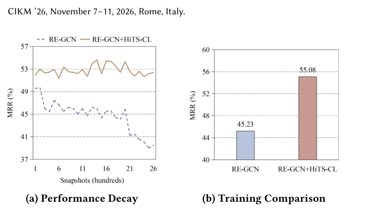

# HiTS-CL: A Continual Learning Framework for Long-Horizon Temporal Knowledge Graph Extrapolation

- arXiv: https://arxiv.org/abs/2609.36559  (v1, submitted 2026-09-29, updated 2026-09-29)
- Authors: Yansong Liu, Rui Liu, Yuan Zuo, Hongwei Zhao, Da Fu, Fuwei Zhang, Fuzhen Zhuang, Yong Chen, Zhe Li
- Categories: cs.LG, cs.AI
- Collected: 2026-10-06 (KST)

## Abstract

Extrapolative temporal knowledge graph reasoning (TKGR) predicts future facts from historical snapshots. Most existing methods train once on an early prefix of the timeline and then use a frozen model for all future timestamps. We argue that this fixed-prefix protocol is misaligned with extrapolation. It learns from a static prefix, whereas the target stream is non-stationary: new entities and facts emerge, temporal dependencies shift across regimes, and recurring historical signals must be refreshed online. As a result, models trained only on early snapshots become outdated and degrade over long horizons. We address this mismatch by formulating extrapolative TKGR as continual learning over streaming snapshots. Under this view, effective extrapolation must jointly handle current dynamics, stable knowledge, and recurring historical evidence. Based on these requirements, we propose History-enhanced Two-Step Continual Learning (HiTS-CL), a backbone-agnostic continual learning framework for extrapolative TKGR. HiTS-CL tracks current dynamics via continual fine-tuning, preserves stable knowledge via multi-teacher adaptive distillation, and retains recurring historical evidence via a selective memory of recent and frequent facts. We integrate HiTS-CL into five representative TKGR backbones and evaluate it on four benchmark datasets. HiTS-CL consistently improves extrapolation accuracy, reduces long-horizon degradation, and outperforms strong continual-learning baselines, including a recent method for temporal knowledge graphs. Source code and data are available at https://github.com/liuyansong98/HiTS-CL.

## Figure 1

Figure 1: (a) Long-horizon performance decay of a fixed-
prefix backbone versus HiTS-CL on the test stream (MRR
averaged over 100 snapshots). Dashed/solid curves denote
the backbone and its HiTS-CL variant. (b) Fixed-prefix train-
ing versus continual updating evaluated on the immediately
following test snapshot after the training period (snapshot
1001; train: 1–1000).
