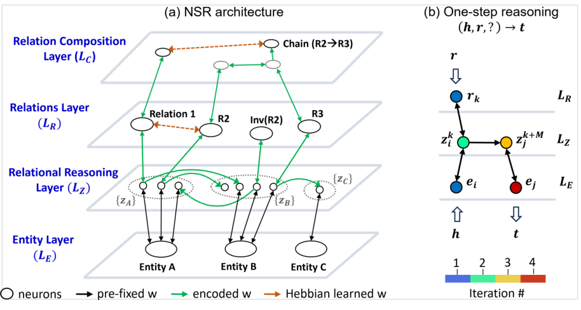

# Neural Structural Reasoner: A Brain-inspired Architecture for Reasoning over Structured Knowledge

- arXiv: https://arxiv.org/abs/2609.36620  (v1, submitted 2026-09-29, updated 2026-09-29)
- Authors: Zixing Jia, Yuhang Pan, Ni Ji
- Categories: cs.AI, q-bio.NC
- Collected: 2026-10-06 (KST)

## Abstract

Structural reasoning, the ability to recognize and make inferences over the relational structure between objects and concepts, is a hallmark of human cognition, yet prevailing methods often collapse relational topology into flat embeddings, cannot discover hidden structure and lack interpretability. We introduce Neural Structural Reasoner (NSR), a brain-inspired network that preserves relational structure directly in the connectivity and dynamics of coupled neuronal populations. NSR draws inspiration from three biological mechanisms: multi-layered architecture for encoding hierarchical knowledge, stable representations of entity and concepts, and path integration for input-driven state inference. At query time, NSR parallelizes computation over candidate relational structures and leverages confidence-weighted scores to perform link prediction. Across standard knowledge-graph benchmarks, NSR achieves competitive accuracy without leading on every dataset, and has lower reported training times than several neural baselines. Because reasoning is implemented through sequences of human-readable neuron activations, NSR affords native interpretability by tracking intermediate inference steps. The model further extracts latent relational hierarchies and compositional rules, demonstrating the brain-inspired architecture as an effective, efficient, and highly interpretable substrate for structural reasoning.

## Figure 1

Figure 1: The Neural Structural Reasoner Architecture. (a) Four core layers of NSR: LE encode
entities; LZ instantiates relation-driven state transition; LR and LC encode relations and their
compositions (e.g., chains). Connections in black are fixed a priori, those in green encode observed
triples, those in orange are learned via Hebbian updates to capture latent relational structure. (b)
Sequence of neuron activation that implements one-step reasoning over (h, r, ?) 7→t.
