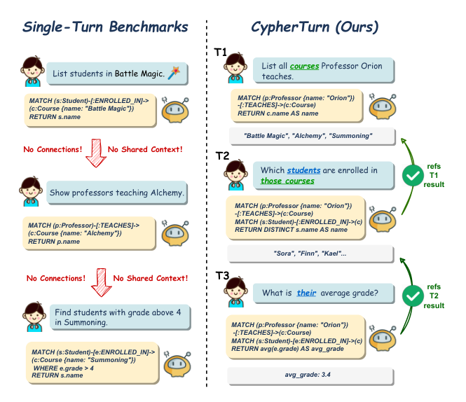

# CypherTurn: A Multi-Turn Benchmark for Conversational Text-to-Cypher Evaluation and the Autonomy Divergence

- arXiv: https://arxiv.org/abs/2609.36987  (v1, submitted 2026-09-29, updated 2026-09-29)
- Authors: Yuzhe Zhang, Weijie Zhu, Haolin Yang, Ziyun Zhang, Xianwei Xue, Mengke Chen, Qiutong Pan, Huaqian Cai
- Categories: cs.CL
- Collected: 2026-10-06 (KST)

## Abstract

Graph databases are increasingly queried through natural language, yet every existing benchmark evaluates isolated single-turn queries rather than the multi-turn sessions through which analysts actually work. We introduce CypherTurn, the first benchmark for conversational Text-to-Cypher evaluation, comprising 721 sessions and 5,927 turns across 7 knowledge graphs and 13 conversational phenomena. We evaluate 15 models under a guided oracle protocol and a fully autonomous agentic protocol, yielding four findings. First, the best model reaches only 64.7% execution accuracy, and session-level correctness remains below 5%. Second, despite strong overall rank correlation, frontier models exhibit a consequential reordering of the top of the leaderboard under autonomous operation, a phenomenon we term the Autonomy Divergence, which reveals error-management as a partially independent capability from raw generation skill. Third, scaling action budgets from x3 to x10 fails to close the autonomy gap, as the strongest frontier models self-limit to approximately two actions per turn regardless of available budget. Fourth, single-turn Cypher fine-tuning degrades multi-turn instruction following, while architecture-appropriate specialization outperforms several frontier models. These results establish CypherTurn as an open challenge for conversational graph database reasoning. Code and data are available at https://github.com/BarryQ/CypherTurn.

## Figure 1

Figure 1: Existing single-turn benchmarks evaluate each
query in isolation (left); CYPHERTURN evaluates chain-
dependent turns in sequence, where each query must be
grounded in its predecessor’s result (right).
