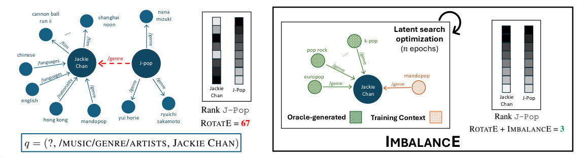

# ImbalancE: Inference-Time Latent Search Against Degree Imbalance in Link Prediction

- arXiv: https://arxiv.org/abs/2609.36996  (v1, submitted 2026-09-29, updated 2026-09-29)
- Authors: Alberto Bernardi, Luca Costabello, Christophe Gueret
- Categories: cs.AI, cs.LG
- Collected: 2026-10-06 (KST)

## Abstract

Knowledge Graph Embedding models have been extensively used to learn representations of entities and relations in Knowledge Graphs for predicting missing links. However, the quality of the learned representations varies a lot across different areas of the graph. If previous research has loosely linked the problem to relation types or degree bias, we show that it is more widespread and it correlates with the degree imbalance of the entities in test triples. In particular, the prediction of a target entity that has a degree much smaller than the degree of the anchor entity is extremely problematic. This is critical in recommender systems and other use cases, where these triples represent important corner cases. To address this issue, we propose an inference-time latent search optimization method capable of significantly improving model predictions on the most imbalanced triples. Built on top of a pre-trained model, it explores the embedding space at evaluation time, blending known and out-of-band information to mitigate the degree imbalance bias. We show the value of our approach on imbalanced triples from common benchmark datasets, where we outperform conventional methods, opening the door to the successful adoption of Knowledge Graph Embedding models on these critical corner cases.

## Figure 1

Fig. 1: We consider a query q with high degree imbalance. In this example taken from
FB15k-237, JACKIE CHAN has degree 49 and J-POP has degree 8 (limited in the figure
for clarity of visualization). IMBALANCE takes the pre-trained embeddings of the KGE
model for the anchor entity and performs an inference-time latent search optimization
on a subset of the original neighborhood enhanced with the triples generated by the
oracle. It then outputs a representation for the anchor node that better aligns with the
selected query, improving the ranking of the target answer from 67 down to 3.
