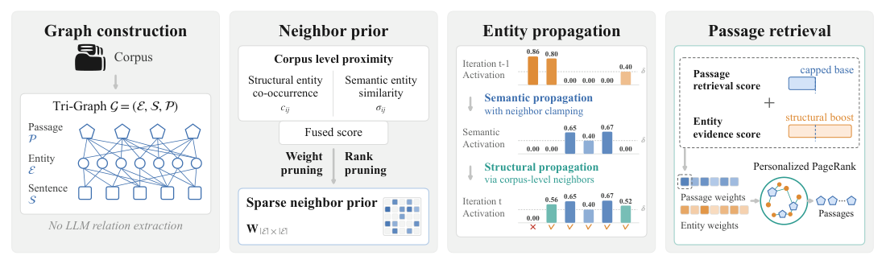

# Corpus-Guided Dual-Path Propagation for Graph Retrieval-Augmented Generation

- arXiv: https://arxiv.org/abs/2609.37661  (v1, submitted 2026-09-29, updated 2026-09-29)
- Authors: Baoxian Liu, Tong Wei
- Categories: cs.CL
- Collected: 2026-10-06 (KST)

## Abstract

Graph-based retrieval-augmented generation supports multi-hop retrieval by organizing corpus information into graphs. However, existing relation-free graph retrieval methods rely primarily on query-sentence similarity to search for evidence. This can exclude useful bridging evidence with low query similarity and activate incidental entities unrelated to the reasoning chain. In this paper, we propose a simple and effective approach called NexusRAG, which augments the relation-free Tri-Graph with a corpus-level entity neighborhood structure derived from joint entity co-occurrence and semantic similarity. NexusRAG employs this structure to guide two complementary propagation paths: neighborhood-constrained semantic propagation through sentences identifies the query-relevant entity frontier, while direct structural propagation between neighboring entities expands that frontier to structurally related entities. The propagated entity weights also inform neighborhood-aware passage initialization for Personalized PageRank. Experiments on three multi-hop QA benchmarks and a domain-specific subset of GraphRAG-Bench show that NexusRAG consistently outperforms existing approaches. On the GraphRAG-Bench subset, NexusRAG achieves the highest evidence recall in all question categories, exceeding baselines by 4.2-8.1 points. The implementation code is available at https://github.com/Jacob-biu/NexusRAG.

## Figure 1

Figure 1: Overview of NexusRAG. 1) Graph Construction. The corpus is indexed into a relation-
free entity–sentence–passage Tri-Graph. 2) Neighbor Prior. A sparse corpus-level entity neighbor
matrix W is constructed from co-occurrence and semantic similarity with rank and weight pruning.
3) Entity Propagation. Given a query q, neighbor-constrained semantic propagation identifies a
query-relevant entity frontier, which structural propagation expands through W to obtain the activated
entity set. 4) Passage Retrieval. Cumulative entity weights and neighbor-aware passage weights
initialize Personalized PageRank for top-K passage retrieval.
