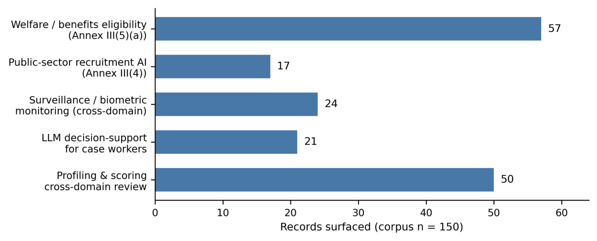

# A Reusable Semantic Web Framework for Evidence-Grounded Fundamental Rights Impact Assessments under the EU AI Act

- arXiv: https://arxiv.org/abs/2609.39537  (v1, submitted 2026-09-30, updated 2026-09-30)
- Authors: Faith Olopade, Delaram Golpayegani, David Lewis
- Categories: cs.CY, cs.AI
- Collected: 2026-10-06 (KST)

## Abstract

The EU AI Act (Art. 27) requires deployers of high-risk AI systems to conduct Fundamental Rights Impact Assessments (FRIAs) before deployment, yet the evidence needed for credible assessments is fragmented across incompatible incident repositories, risk vocabularies, and legal texts. We present a reusable Semantic Web-based framework that consolidates this evidence for two high-risk public sector categories: employment and worker management (Annex III(4)) and access to essential public services (Annex III(5)(a)). A curated 150-record corpus is annotated along four axes using keyword, LLM, and hybrid methods and serialised as a SPARQL-queryable knowledge graph of 1,351 RDF triples. Five FRIA demonstration scenarios surface 103 records (68.7% coverage). Evaluation against a 69-record gold standard reveals that LLM-assisted classification of the employment domain achieves only $κ= 0.045$, a cautionary result for automated fairness-related evidence retrieval in this domain. All artefacts are released openly to support adoption by regulators, national authorities, and SMEs.

## Figure 1

Fig. 1. Records surfaced by each of the five FRIA demonstration scenarios. Scenarios may retrieve overlapping records; their
union is 103 of the 150 corpus records (68.7% coverage). The employment recruitment scenario surfaces the fewest records,
mirroring the near-chance employment domain classification.
