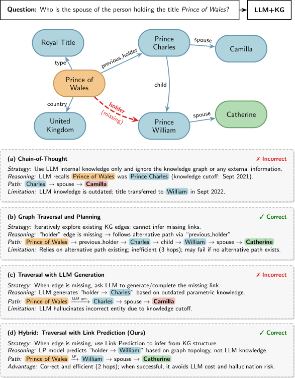

# Explore-on-Graph: Hybrid Embedding-LLM Reasoning for Knowledge Graph Question Answering under Incompleteness

- arXiv: https://arxiv.org/abs/2609.39786  (v1, submitted 2026-09-30, updated 2026-09-30)
- Authors: Ola El Khatib, Djellel Difallah
- Categories: cs.CL
- Collected: 2026-10-06 (KST)

## Abstract

Large language models (LLMs) are increasingly combined with knowledge graphs (KGs) to ground reasoning in structured evidence. However, most LLM-based KGQA methods rely on traversing existing graph edges and become unreliable when reasoning paths are broken by missing facts. Alternatives that ask LLMs to generate missing knowledge risk introducing hallucinated evidence. We introduce XoG (eXplore-on-Graph), a framework for multi-hop question answering over incomplete KGs that recovers missing reasoning paths from learned graph structure rather than LLM parametric knowledge. XoG combines type-level entity-relation statistics to identify candidate relations with KG embeddings to retrieve plausible missing entities, using the LLM as a semantic selector and reasoner. These mechanisms are integrated into an iterative planning-exploration-reasoning process. Experiments on WebQSP, CWQ, and the Wikidata-based BRINK benchmark show that XoG remains competitive on complete KGs and consistently outperforms comparable methods without task-specific KGQA training under KG incompleteness. These gains persist across multiple LLM backbones, indicating that stronger LLMs alone do not resolve missing graph evidence. XoG also reduces LLM token consumption by up to 33% compared with a closely related planning-based approach.

## Figure 1

Figure 1:
Comparison of LLM+KG reasoning
paradigms.
