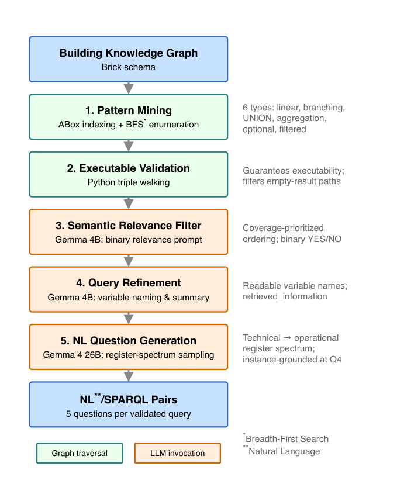

# Build2SPARQL: A Large-Scale Text-to-SPARQL Benchmark Dataset for Building Knowledge Graph Querying

- arXiv: https://arxiv.org/abs/2610.00224  (v1, submitted 2026-09-22, updated 2026-09-22)
- Authors: Wooyoung Jung
- Categories: cs.AI
- Collected: 2026-10-06 (KST)

## Abstract

Building automation systems are increasingly represented as semantic knowledge graphs (KGs) using ontologies such as Brick and ASHRAE 223P, creating a machine-readable substrate for artificial-intelligence applications. One promising application is translating natural-language questions into SPARQL (text-to-SPARQL), which would let building operators query these graphs through language agents, but progress is limited by the scarcity of large natural-language/SPARQL benchmarks. This paper presents Build2SPARQL, a large-scale benchmark for building KGs generated by a KG-grounded pipeline: SPARQL queries are produced and validated entirely by graph-traversal code, while large language models generate only the natural-language questions, keeping query correctness independent of model behavior. The pipeline mines six query-pattern families -- linear chains, branching, UNION, aggregation, OPTIONAL, and attribute-filtered -- and phrases each query across five vocabulary registers. Applied to 201 building KGs (180 Brick, 21 ASHRAE 223P), it yields 6,136 executable SPARQL queries and 30,680 questions. A two-rater human validation of 300 questions found 98.8% semantic fidelity, 98.8% naturalness, and 84.0% operational plausibility. A retrieval-augmented evaluation across three open-weight language models raised exact-match accuracy from 0.2-20% (zero-shot) to 56-65% (three-shot retrieved).

## Figure 1

Fig. 1. Build2SPARQL five-stage pipeline.
