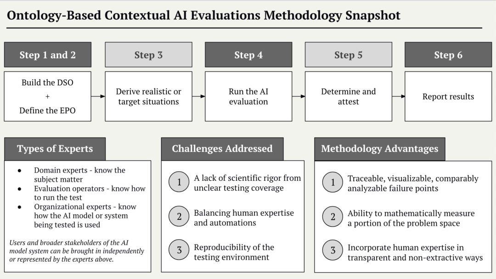

# Ontology-Based Contextual AI Evaluations (OB-CAIE) Methodology

- arXiv: https://arxiv.org/abs/2610.00529  (v1, submitted 2026-09-30, updated 2026-09-30)
- Authors: Julie Krugler Hollek, Michael Zargham, Mala Kumar
- Categories: cs.AI, cs.CY
- Collected: 2026-10-06 (KST)

## Abstract

The ontology-based contextual AI evaluation (OB-CAIE) methodology was developed to address a lack of scientific rigor that arises from unclear testing coverage, to balance human expertise and automations, and to address a lack of reproducibility of AI evaluation testing environments. OB-CAIE strengthens the current state of AI evaluations by addressing the first step in the scientific method by clearly defining what will be tested. Two ontologies represent the tractable problem space in the OB-CAIE methodology: the Domain-Specific Ontology (DSO) and the Evaluation Process Ontology (EPO). The DSO is the what; the EPO is the how. An OB-CAIE problem space can be used for one or multiple AI evaluations. The OB-CAIE methodology allows for human judgment at specific points, in scientifically grounded ways, and in complex subject areas where human feedback is genuinely irreducible or machine irreplaceable. A key advantage of the OB-CAIE methodology is that failure points can be traced, visualized and analyzed within the canonical OB-CAIE methodology problem space.

## Figure 1

Figure 1: An overview of the OB-CAIE methodology
