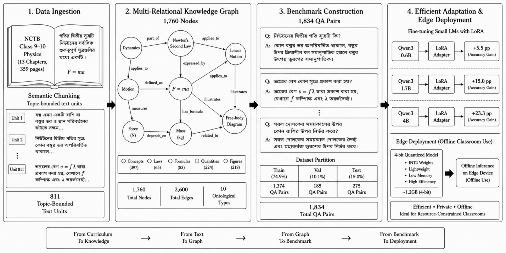

# PhysicsMate: A Curriculum-Grounded Bengali Benchmark for Secondary Physics QA with Small-Model Adaptation

- arXiv: https://arxiv.org/abs/2610.00664  (v1, submitted 2026-09-30, updated 2026-09-30)
- Authors: Rashid Azraf Jahin, Saadman Sajid, Khan Raiyan Ibne Reza, Sumaiya Tabassum Nimi
- Categories: cs.CL
- Collected: 2026-10-06 (KST)

## Abstract

Bengali secondary education lacks curriculum-grounded benchmarks for STEM question-solving, and general-purpose language models struggle with the precise terminology, unit conventions, and derivations that physics problems demand. We introduce PhysicsMate, a benchmark of 1834 question-answer pairs built from the National Curriculum and Textbook Board (NCTB) Grade 9-10 physics syllabus and grounded in a multi-relational knowledge graph of 1760 nodes and 2600 edges across ten ontological types. We Low-Rank Adapt at 0.6B, 1.7B, and 4B parameters, with a unified recipe and demonstrate a significant increase in closed-book accuracy in all scales (+5.5, +15.0, and +23.3 percentage points). A node-type analysis shows that the most benefited by adaptation is the structured curricular knowledge, which consists of physical quantities and named laws, while the least benefited is the loosely specified entity-level knowledge. The 4B model has been adapted and quantized to a small offline binary that can be used for local inference in resource constrained environments and offers a viable path to curriculum aligned physics support in environments with limited connectivity and hardware.

## Figure 1

Fig. 1.
The end-to-end PhysicsMate workflow. (1) Data Ingestion: page-level OCR of the NCTB Grade 9-10 physics textbook, Markdown normalization,
and three-page contextual knowledge extraction yielding 811 semantic units; (2) Multi-Relational Knowledge Graph: a 10-type domain ontology with 1,760
nodes and 2,600 directed edges; (3) Benchmark Construction: 1,834 curriculum-grounded Bengali QA pairs stratified into Train/Val/Test; and (4) Efficient
Adaptation & Edge Deployment: LoRA fine-tuning of Qwen3 models with 0.6B, 1.7B, and 4B parameters, along with 4-bit offline quantization.
