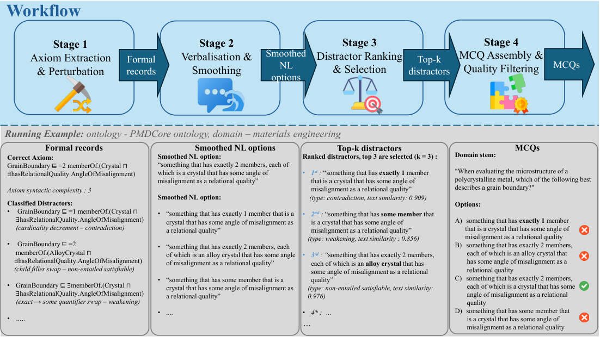

# Ontology-Grounded, Reasoner-Verified Benchmarks for Evaluating LLM Reasoning in Scientific AI

- arXiv: https://arxiv.org/abs/2610.00682  (v1, submitted 2026-09-30, updated 2026-09-30)
- Authors: Nishtha N. Vaidya, Stephan Grimm, Thomas Hubauer, Thomas A. Runkler
- Categories: cs.AI, cs.LG
- Collected: 2026-10-06 (KST)

## Abstract

Large language models (LLMs) increasingly underpin scientific AI applications that reason over structured knowledge, from biomedical question answering to materials informatics. However, their logical reasoning often falls short, producing factual inaccuracies unacceptable in these settings. Reliable evaluation remains challenging: manual dataset construction scales poorly, and LLM-based generation risks embedding the very flaws it aims to measure. High-quality benchmarks must ground both correct and incorrect labelled examples in explicit background knowledge, formally verifiable by a standard reasoner. We propose a pipeline that automatically generates ontology-grounded multiple-choice question (MCQ) benchmarks from any sufficiently axiomatised OWL 2 ontology, with correct answers grounded in the ontology by design. Distractors are generated by perturbing the right-hand-side class expressions of class definition axioms, and their incorrectness is formally verified by an OWL reasoner via entailment checks. We evaluate the pipeline on three ontologies: Pizza (small, academic), PMDco (complex, materials science), and DOID (large, biomedical), generating 112, 2,491, and 15,216 MCQs respectively. Distractors span four semantic categories from class unsatisfiability to weakened subsumptions, enabling diagnostic evaluation of specific reasoning failures. Items meet natural language quality standards: mean LLM judge scores of 4.02, 4.36, and 3.36 out of 5 confirm fluency, and correct-answer-to-distractor similarity above 0.8 shows that wrong options cannot be dismissed on surface form alone. Six LLMs evaluated zero-shot achieve 41.1-76.8% accuracy, well above the 25% random-guessing baseline, indicating the benchmarks are challenging and discriminative. This work is a step towards more reliable benchmarks for assessing logical reasoning in scientific AI.

## Figure 1

Figure 1: Four-stage pipeline for generating ontology-grounded multiple-choice questions. Stages
proceed left to right and the bottom row illustrates each stage with an example from PMDco.
