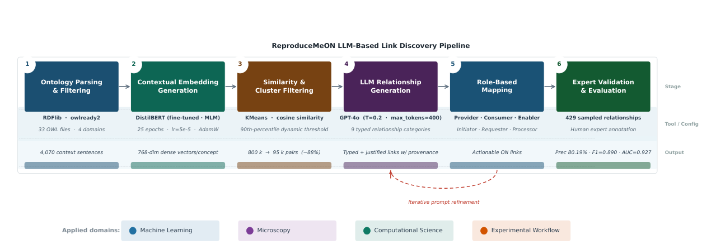

# LLM-Assisted Discovery of Typed Semantic Links for Ontology Network Construction

- arXiv: https://arxiv.org/abs/2610.01393  (v1, submitted 2026-10-01, updated 2026-10-01)
- Authors: Nouha Hayouni, Sheeba Samuel, Alsayed Algergawy
- Categories: cs.CL, cs.AI
- Collected: 2026-10-06 (KST)

## Abstract

Constructing typed, justified semantic links between ontologies is essential for enabling interoperability across heterogeneous and interdisciplinary knowledge domains. However, manually curating such links is difficult to scale. To address this challenge, we propose an end-to-end framework for ontology network construction that automates the discovery and generation of both intra-domain and inter-domain relationships. Our approach combines domain-adapted DistilBERT embeddings for dense contextual representation, clustering-based pre-filtering to reduce the candidate search space, and GPT-4o-driven relationship generation via iterative prompt engineering to produce semantically rich, interpretable links. Applied to ReproduceMeON - a network of 33 ontologies spanning machine learning, microscopy, computational science, and experimental workflow - the pipeline reduces approximately 800k raw concept pairs to 95k high-quality candidates. Human expert validation of 429 generated relationships by two independent annotators yields an overall precision of 80.19% (91.49% on high-certainty annotations) and an F1 of 0.890, with substantial inter-annotator agreement. Comparative experiments against five similarity-based baselines, including Sentence-BERT, show a substantial performance gap (best baseline F1 = 0.581), while an ablation study demonstrates that similarity-based methods alone fail to discriminate valid from invalid relationships (AUC approx 0.5) on the filtered candidate set. These findings highlight the necessity of LLM-based reasoning over concept roles and domain semantics for accurate relationship construction.

## Figure 1

Figure 1: Overview of the proposed end-to-end pipeline for discovering and generating intra- and inter-domain
links for the development of ReproduceMeON ontology network.
