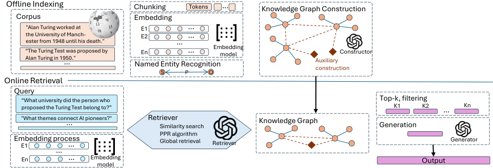

# Hop-Decayed Influence: New Vulnerabilities of Structural Auxiliary Indexing in GraphRAG Pipelines with LLM

- arXiv: https://arxiv.org/abs/2610.02373  (v1, submitted 2026-10-01, updated 2026-10-01)
- Authors: Jisung Park, John Le, Heath Cooper
- Categories: cs.CR, cs.AI
- Collected: 2026-10-06 (KST)

## Abstract

GraphRAG pipelines construct auxiliary structures during offline indexing--semantic summaries, hierarchical edges, and pre-computed scores--that determine how retrieval is prioritised at query time. Prior attacks target only instance-level components (nodes, edges, triples), overlooking these schema-level structures. We formalise Auxiliary Schema-Level Entity as a novel attack surface and propose the 3S Framework (Semantics, Structure, Scoring) for its systematic exploitation. Our Hop-Decayed Influence (HDI) attack identifies high-impact targets through query-aware influence propagation and corrupts their auxiliary structures post-indexing. Across two benchmarks (HotpotQA, 2WikiMultiHopQA) and two architectures (Microsoft GraphRAG, HippoRAG2), HDI achieves 88-94% attack success rate while modifying as few as 0.016% of auxiliary structures. Each modification affects up to 6.00 queries (Schema Leverage Ratio), demonstrating 1:N amplification unavailable to instance-level attacks. Manipulated structures evade perplexity and paraphrase defenses with over 99% evasion rate, as they remain linguistically coherent system-generated artifacts. These results reveal that auxiliary schema-level entities receive implicit trust without runtime validation, constituting a structural blind spot in current GraphRAG defenses. https://github.com/Jisung-Pacific/HDI-GraphRAG-Attack.

## Figure 1

Fig. 1. A process of GraphRAG pipeline
