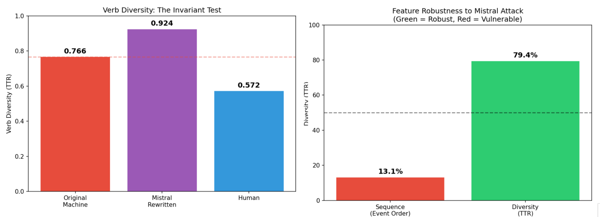

# Ontological Instability and Statistical Amplification: The Paradox of "Humanizing" LLM-Generated Text

- arXiv: https://arxiv.org/abs/2610.03110  (v1, submitted 2026-10-02, updated 2026-10-02)
- Authors: Claudiu Creanga, Liviu Dinu
- Categories: cs.CL
- Collected: 2026-10-06 (KST)

## Abstract

Supervised AI-text detectors report high benchmark accuracy, but it is not clear what their decisions are based on. We analyze a RoBERTa-based detector under semantic, structural, and tokenizer-level perturbations, using the M4 dataset (N = 10,000) and controlled generations (N = 300). When Mistral-7B-Instruct was asked to make machine text sound more human, Verb Diversity rose from 0.77 to 0.92 and the outputs became easier to detect. Detection scores appear to track statistical complexity, which also leads to a 76.3% false-positive rate on formal human writing. As a control, we evaluate event-based Latent Space detection. Paraphrasing changed 87% of its event sequences (Jaccard = 0.067), and homoglyphs altered 70% of the extracted verbs even though extraction still ran (Jaccard = 0.30). Its best domain AUC was 0.577. RoBERTa's robustness seems specific to the features it uses, and structural abstraction did not make detection more robust.

## Figure 1

Figure 1: Left: Verb Diversity before (0.766) and after (0.924) Mistral-7B rewriting, with the
human baseline (0.572). Right: stability of statistical features (79.4%) and of event sequences
(13.1%) under rewriting.
