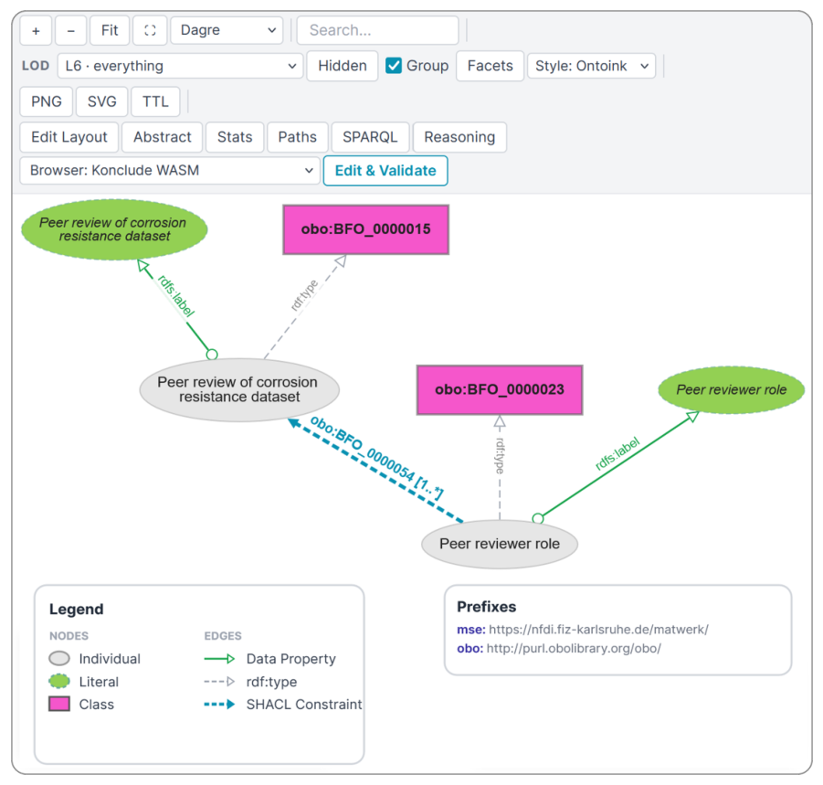

# OntoInk: Interactive Ontology Visualization, Validation, and Reasoning

- arXiv: https://arxiv.org/abs/2610.05945  (v1, submitted 2026-10-05, updated 2026-10-05)
- Authors: Ebrahim Norouzi, Jörg Waitelonis, Harald Sack
- Categories: cs.AI, cs.IR
- Collected: 2026-10-07 (KST)

## Abstract

Ontology documentation, visualization, and validation are usually carried out with separate tools. This split workflow slows down development and makes knowledge transfer harder. We present OntoInk, an open-source MkDocs plugin that brings these activities together. Within a single documentation-as-code pipeline, OntoInk renders interactive ontology diagrams, validates instance data against SHACL shapes, runs OWL\,DL reasoning, and supports inline Turtle editing. General-purpose diagram plugins for MkDocs cannot parse RDF, dereference IRIs, overlay SHACL constraints, or run OWL reasoning. Compared with standalone ontology visualization tools, OntoInk embeds interactive and editable diagrams directly into documentation pages. A live demo and source code are available at \url{https://ise-fizkarlsruhe.github.io/ontoink/}.

## Figure 1

Figure 1: The Role Realization SHACL shape of the MatWerk KG, rendered by OntoInk.
