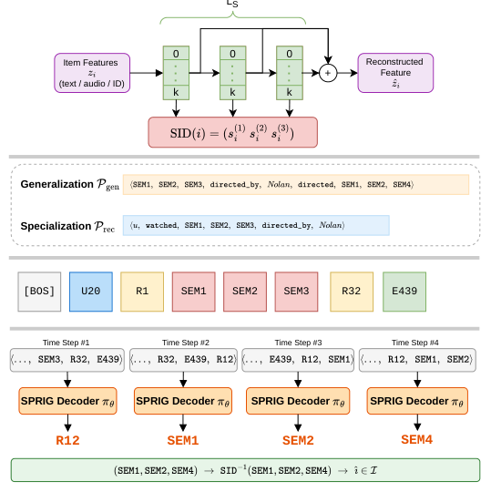

# SPRIG: Semantic-ID-enhanced Paths for Knowledge Graph-based Generative Recommendation

- arXiv: https://arxiv.org/abs/2610.06590  (v1, submitted 2026-10-05, updated 2026-10-05)
- Authors: Justin Hangoebl, Marta Moscati, Alessandro B. Melchiorre, Shah Nawaz, Markus Schedl
- Categories: cs.IR
- Collected: 2026-10-07 (KST)

## Abstract

Recommender systems leveraging generative models often generate item identifiers directly, rather than ranking catalog items by a recommendation score. Recent work extends beyond pure sequential interaction signals by incorporating item content and structured relationships among items, with two distinct directions emerging. Semantic IDs (SIDs) enrich item representations by replacing opaque, randomly initialized embeddings with hierarchically quantized discrete codes derived from item content. Knowledge-graph (KG) path reasoning instead generates entity-relation paths that ground recommendations in structured relationships between items, attributes, and external entities, thereby enriching the relational context. These two lines have complementary limitations: SID-based models lack relational grounding, while KG-based generative recommenders still represent items as arbitrary, opaque tokens tied to large embedding tables, limiting parameter sharing and generalization. We propose SPRIG, a generative recommender that integrates content-derived SIDs into KG path reasoning. SPRIG is trained on information-rich KG paths that terminate in items represented as discrete, content-derived tokens, combining the advantages of both approaches. We evaluate SPRIG on movie and music recommendation datasets against baselines spanning sequential language models, KG-augmented methods, and SID-based approaches. Our results show that SPRIG achieves competitive performance over prior generative models while using fewer parameters and a lower compute cost. Code: https://github.com/justinhangoebl/semantic-id-knowledge-graph-recommender

## Figure 1

Figure 1: SPRIG framework. Item features are encoded into hierarchical Semantic IDs; SID-augmented KG paths (generic for pretraining, user-to-item for fine-tuning) are tokenized and fed to a causal Transformer decoder that autoregressively generates paths. Section 2 follows a concrete movie example (Inception, Interstellar) through all four stages.
