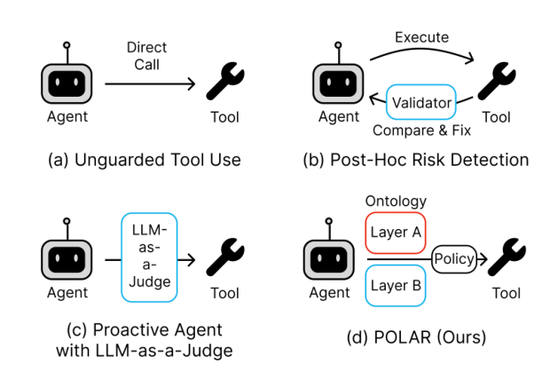

# POLAR: Ontology-Guided Risk Prevention for Tool-Calling LLM Agents

- arXiv: https://arxiv.org/abs/2610.08082  (v1, submitted 2026-10-06, updated 2026-10-06)
- Authors: Yunju Kang, Seonghyeon Cho, Irene Li, Yeo-Chan Yoon, Chanjun Park
- Categories: cs.AI, cs.CL
- Collected: 2026-10-08 (KST)

## Abstract

LLM tool-use agents operate in dynamic environments where many actions carry operational risk. However, most safety mechanisms react only after errors manifest. Existing pre-emptive approaches either fine-tune the agent on chain-of-thought deliberation or compile natural-language guardrails into runtime checks, but they do so without exposing a structural, auditable verdict. We propose POLAR, a guardrail framework for small tool-calling agents that assesses reversibility through a structured two-layer ontology. POLAR assigns each action a graded reversibility score by deriving a candidate inverse sequence; calls failing a threshold are pruned before execution. Evaluated on $τ^2$-bench across six agent models, POLAR improves mean task reward by 0.11 to 0.18 points on airline for four of six agents, but only eight of eighteen model--domain cells improve overall; retail and stronger agents often regress. POLAR provides an auditable structural check and characterizes its task-utility trade-offs. Reward is not a direct measure of prevented harm.

## Figure 1

Figure 1: Four safety patterns for tool-calling LLM agents. (a) Unguarded: the agent simply calls the tool. (b) Post-Hoc Risk Detection: the tool executes and a registered compensator may undo it after observa- tion. (c) Proactive Agent with LLM-as-a-Judge: an LLM gates the call with an allow-or-block label and no structural basis. (d) POLAR (Ours): a structural reverse search over the typed action ontology (Layer A) and the actual state (Layer B) produces an inverse se- quence π and an auditable score, which a pluggable DecisionPolicy converts into the verdict.
