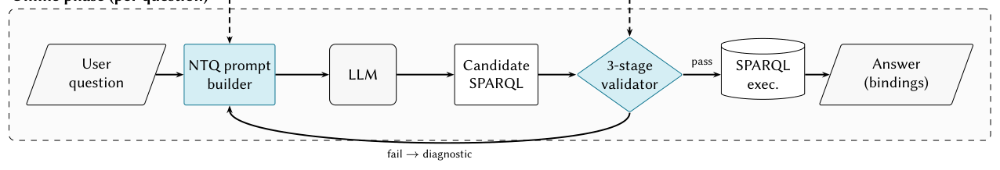

# Natural Language Questions as an Interface for Knowledge Graphs: QRAKEN Graph Distillation and Semantic Self-Healing

- arXiv: https://arxiv.org/abs/2610.08095  (v1, submitted 2026-10-06, updated 2026-10-06)
- Authors: Remo Grillo, Lukas Klic, Giovanni Colavizza
- Categories: cs.AI, cs.CL
- Collected: 2026-10-08 (KST)

## Abstract

Natural-language access to RDF knowledge graphs is a core Semantic Web ambition. Large language models (LLMs) have advanced Text-to-SPARQL, yet on unfamiliar graphs they often generate valid queries that misrepresent the populated data model. QRAKEN is a training-free, ontology-agnostic neurosymbolic pipeline grounding generation in empirical graph evidence rather than schema expectations. An offline distiller produces TTQL, a compact description of populated multi-hop patterns, conditional frequencies and path-conditioned literal examples, plus a class-property co-occurrence matrix. Online, TTQL guides the LLM, while deterministic syntax, vocabulary and data-model checks provide diagnostics for iterative refinement. On CK25 (First International Text2SPARQL Challenge), under matched-condition recomputation on a QLever snapshot, QRAKEN achieves strict F1 of 0.643 $\pm$ 0.026 with GPT-4.1 mini and 0.652 $\pm$ 0.012 with GPT-5.4: relative gains of 30% and 32% over the strongest recomputed participant, outperforming systems using the same base model family. Ablations identify TTQL patterns as the dominant driver (+0.31 strict F1 over a shape-only baseline); the refinement loop provides a cheap safety net, rejecting triple patterns unsupported by the co-occurrence matrix. Compared with auto-derived SHACL, TTQL yields 64% higher strict F1, supporting the value of empirical patterns beyond schema exposure. With two local 35B 4-bit open-weight models at zero marginal cost, the same pipeline matches the strongest recomputed participant, and TTQL advantages over shape-only and SHACL baselines persist. Results on a single, relatively small benchmark provide an initial empirical signal; monolithic TTQL injection on very open cross-domain graphs remains the main limitation.

## Figure 1

Figure 1: QRAKEN architecture. The offline phase (top) distills the populated graph into a TTQL file (injected into the LLM prompt) and a co-occurrence matrix (kept machine-side for deterministic checks). The online phase (bottom) couples LLM-based SPARQL generation with a three-stage correctness-guided self-healing loop (curved arrow: fail →diagnostic); only queries that pass all three stages are executed. The TTQL artifact is produced once per graph and reused across all questions.
