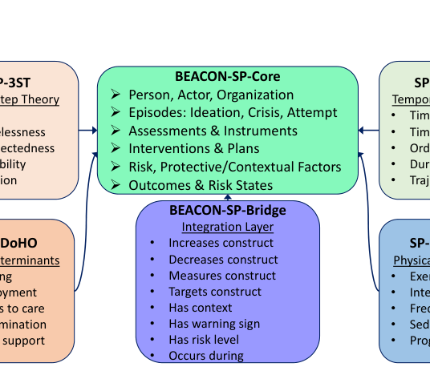

# BEACON-SP: Ontology-Grounded GraphRAG Framework for Clinical Suicide Risk Assessment

- arXiv: https://arxiv.org/abs/2610.09026  (v1, submitted 2026-10-06, updated 2026-10-06)
- Authors: Kemal Davaslioglu, Nathan Conger, Sastry Kompella, Yalin E. Sagduyu, Nathaniel D. Bastian
- Categories: cs.AI, cs.CL, cs.IR
- Collected: 2026-10-08 (KST)

## Abstract

We present BEACON-SP, an ontology-grounded Graph Retrieval-Augmented Generation (GraphRAG) framework for clinician-facing decision support in behavioral health settings such as suicide prevention, where effective assessment requires integrating heterogeneous clinical, behavioral, social, and temporal evidence. BEACON-SP combines patient knowledge graphs with ontology-guided retrieval to support multi-hop reasoning across diagnoses, medications, risk and protective factors, life events, and temporal relationships. The framework is enabled by a comprehensive suicide prevention ontology that integrates the Three-Step Theory, the Integrated Motivational-Volitional Model, and the Suicide Social Determinants of Health Ontology into a unified representation of patient risk factors. We construct ontology-grounded patient knowledge graphs and evaluate BEACON-SP for clinician-facing question answering. Compared with a vector-based retrieval-augmented generation (RAG) baseline on a 1,500-query benchmark spanning 15 clinical categories and 100 patients, BEACON-SP improves completeness, clinical relevance, and evidence grounding under a corrected comparative evaluation protocol, with a small gain on factual accuracy. In paired criterion-level comparisons, GraphRAG is preferred in 76.4% of cases. These results demonstrate the potential of ontology-guided GraphRAG to provide structured, contextualized patient evidence for clinical decision support.

## Figure 1

Fig. 1: BEACON-SP Ontology components.
