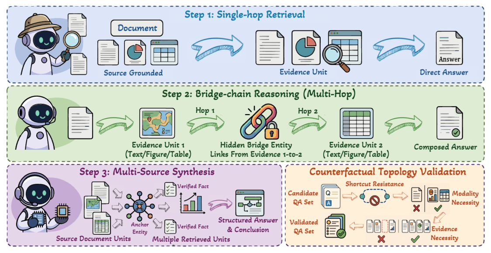

# TopoGraphRAG-Bench: Evaluating Multimodal GraphRAG on Layout-Grounded Evidence Reasoning

- arXiv: https://arxiv.org/abs/2610.09360  (v1, submitted 2026-10-07, updated 2026-10-07)
- Authors: Ruochi Li, Jianzhe Lin, Haoxuan Zhang, Haihua Chen, Junhua Ding, Edward Gehringer, Yang Zhang
- Categories: cs.AI, cs.CL
- Collected: 2026-10-08 (KST)

## Abstract

Real-world documents distribute evidence across text, tables, figures, and captions within complex page layouts. Answering complex questions over such documents therefore requires more than retrieving relevant passages: systems must recover the evidence topology that connects heterogeneous evidence units. Existing GraphRAG evaluations remain largely text-centered, while multimodal document RAG benchmarks assess cross-modal retrieval and generation without directly evaluating recovery of the intended evidence topology. We introduce TOPOGRAPHRAG-BENCH, a layout-grounded benchmark for multimodal evidence reasoning in GraphRAG, comprising 2,024 questions over 201 long, visually rich documents. Questions are constructed bottom-up from text, figure, and table evidence units under three controlled topologies: single-hop retrieval, bridge-chain reasoning, and multi-source synthesis. To ensure that questions preserve their intended structure, we apply counterfactual validation for shortcut resistance, modality necessity, and evidence necessity. We evaluate text-only GraphRAG, page-level visual retrieval, and multimodal GraphRAG systems using retrieval, generation, and topology-aware reasoning metrics. Multimodal GraphRAG systems achieve the strongest overall performance, but still fail when visual-textual evidence alignment or multi-unit composition is incomplete. Text-only GraphRAG struggles when key dependencies are grounded in figures or tables, while page-level visual retrieval lacks the fine-grained structure needed for topology recovery. These findings motivate GraphRAG systems that move beyond text-derived entity relation graphs to explicitly model document layouts, cross-modal evidence alignment, and the reasoning roles of evidence units. Code and data are available at https://richardlrc.github.io/TopoGraphRAG-Bench/.

## Figure 1

Figure 1: Overview of the TopoGraphRAG benchmark construction and validation pipeline. Starting from layout-grounded document evidence units, the pipeline constructs single-hop, bridge-chain, and multi-source synthesis QA instances, and then applies counterfactual topology validation to test shortcut resistance, modality necessity, and evidence necessity.
