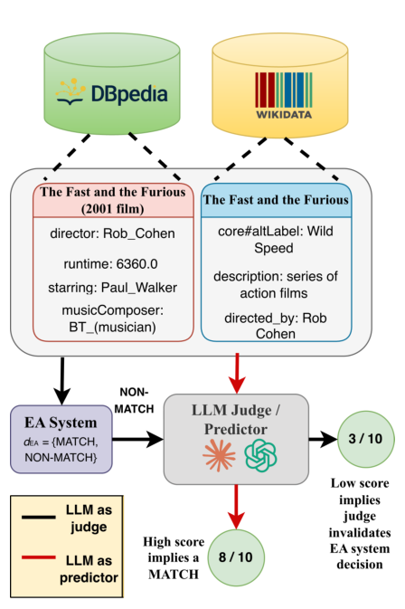

# Reliability of LLM Judges for Evaluating Entity Alignment

- arXiv: https://arxiv.org/abs/2610.09554  (v1, submitted 2026-10-07, updated 2026-10-07)
- Authors: Vaibhava Lakshmi Ravideshik, Mayank Kejriwal
- Categories: cs.AI
- Collected: 2026-10-08 (KST)

## Abstract

Entity Alignment (EA) identifies equivalent entities across knowledge graphs and is critical for knowledge base integration and ontology merging. Evaluating EA systems at scale requires expensive expert annotation, making systematic assessment across diverse domains practically infeasible. LLM-as-judge evaluation offers a potentially scalable alternative, yet its reliability for structured prediction tasks like EA remains unstudied. We present the first systematic benchmarking study across three frontier models, three datasets, and four EA systems, using perturbation bias diagnostics, meta-evaluation across all dataset-judge-prompt combinations, and counterfactual label-flip tests. We identify anchor bias, a failure mode in which judges invert discrimination when the system's decision label is visible. Label exposure causally collapses judge discrimination (J-ROC-AUC 0.12-0.87), while a label-free protocol recovers near-ceiling capability on distinctive-name datasets (0.93-1.00) and significant recovery on biomedical pairs (0.93-0.95). Counterfactual experiments confirm causality (FSR 53-99%) and reveal a frontier model paradox: stronger judges exhibit greater label sensitivity, not less. A blinded two-annotator human evaluation (102 pairs, Cohen's kappa=0.902) confirms this mechanism directly. We release the first biomedical EA benchmark (MeSH-SNOMED CT, 15K pairs) and a reproducible auditing framework for LLM judge reliability in EA. Code and data are available at https://github.com/vaibhavalakshmiravideshik/llm-as-a-judge-entity-alignment.

## Figure 1

Figure 1: LLM-as-judge evaluation for entity alignment, illustrated using D-W-15K (DBpedia–Wikidata). The two KG entities share the name “The Fast and the Furi- ous” and the same director, but refer to different things: Entity A (DBpedia) is the 2001 film; Entity B (Wikidata) is the entire franchise series. The correct alignment label is NON-MATCH. Black path (LLM as judge): The EA system correctly predicts NON-MATCH; the LLM judge scores this decision 3/10, implying it considers NON- MATCH unjustified—anchoring on the shared name and director rather than reasoning from evidence. Red path (LLM as predictor): When the entity pair is sent di- rectly to the LLM without any system label, it predicts MATCH with 8/10 confidence—again anchored on sur- face name similarity.
