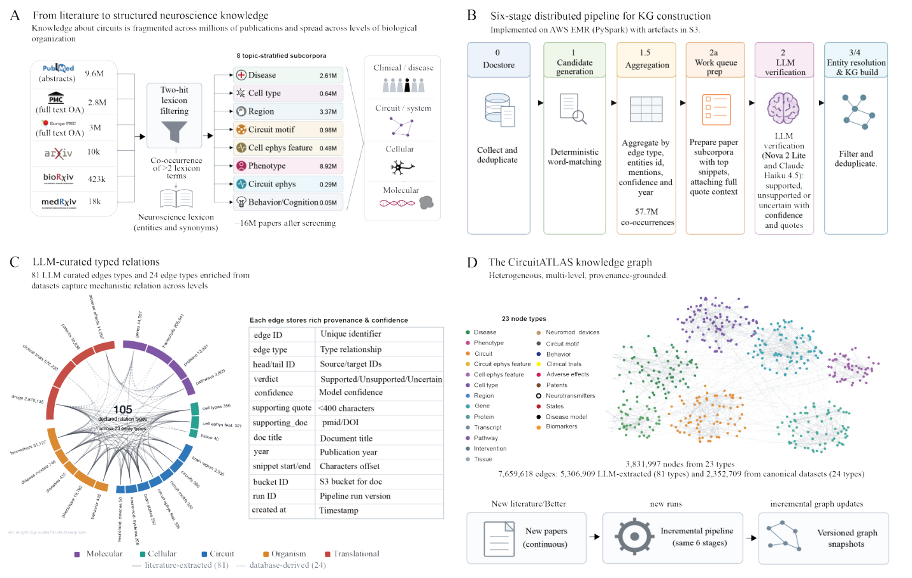

# CircuitATLAS: Agentic reasoning over a systems neuroscience knowledge graph for target discovery in circuitopathies

- arXiv: https://arxiv.org/abs/2610.09643  (v1, submitted 2026-10-07, updated 2026-10-07)
- Authors: Gabriel Ocana-Santero, Marko Tvrdic
- Categories: q-bio.QM, cs.AI, q-bio.NC
- Collected: 2026-10-09 (KST)

## Abstract

Drug discovery for neurological disease has traditionally centered on the molecules altered by disease. But the molecules that cause pathology are not necessarily the best points from which to reverse it. Here, we ask which otherwise unaltered molecular control points can be engaged to restore pathological neural circuits toward functional states. We present CircuitATLAS, a provenance-grounded systems-neuroscience knowledge graph and agentic framework for target discovery in circuitopathies. It structures literature-derived relationships across diseases, phenotypes, electrophysiology, circuits, brain regions, cell types and molecular effectors, while deliberately excluding direct disease-gene and disease-protein edges to reduce shortcut reasoning. The graph contains 3.83 million nodes and 7.66 million edges, including 5.31 million LLM-extracted relations, and incorporates structured datasets such as the Human Cell Atlas and new multimodal in vivo measurements. We then introduce an agentic workflow that reasons from measurable disease phenotypes through their circuit and cellular substrates to molecular interventions, therapeutic feasibility and clinical constraints. Finally, we introduce a human-governed in vivo lab-in-the-loop linking hypothesis generation to experimental iteration. Within this framework an agent nominated ATP1A3, the neuronal alpha3 Na+/K+-ATPase, as a control point on cortical excitability; interneuron-restricted expression of ATP1A3 abolished the beta- and gamma-band response to a focal 4-aminopyridine challenge in vivo, and the validated target was then carried into a structure-guided small-molecule campaign terminating in a defined assay to resolve the direction of modulation. CircuitATLAS thus provides a framework for discovering therapeutics based not only on what is molecularly disrupted in disease, but on what can be controlled to restore circuit function.

## Figure 1

Figure 1. Construction and structure of the CircuitATLAS knowledge graph. (A) Schematic of the literature- screening workflow. Sources shown are PubMed abstracts, PubMed Central full text, Europe PMC full text, arXiv, bioRxiv, and medRxiv. Records are passed through two-hit lexicon filtering and co-occurrence of at least two lexicon entities, yielding 15.9 million papers after screening. Retained papers are assigned to eight topic-stratified subcorpora: disease, cell type, region, circuit motif, cell electrophysiology feature, phenotype, circuit electrophysiology feature, and behavior/cognition. (B) Schematic of the six-stage distributed pipeline for knowledge-graph construction. The stages shown are datastore, candidate generation, aggregation, work-queue preparation, LLM verification, and entity resolution/KG load. Candidate mentions are aggregated by edge type, entities, confidence, and year, producing 57.7 million co-occurrences. The verification stage shows supported, unsupported, or uncertain classifications with confidence scores and quotations. (C) Circular summary of LLM- curated typed relations and a table showing example edge fields. The graph is organized into molecular, cellular, circuit, organism, and translational levels. The center indicates 105 directed relation types. The accompanying table lists stored edge attributes, including edge ID, edge type, head and tail IDs, verdict, confidence, supporting quote, supporting IDs, document title, year, snippet start/end, bucket ID, run ID, and creation time. (D) Overview of the CircuitATLAS knowledge graph. Colored node clusters are shown for 23 node types. The graph contains 3,831,997 nodes and 7,659,618 edges, including 5,306,909 LLM-extracted edges and 2,352,709 edges from canonical datasets. A schematic at the bottom shows incorporation of new literature through incremental pipeline runs and versioned graph snapshots.
