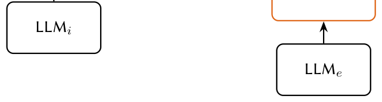

# Automatically Building and Updating a Knowledge Graph of MLIP Models

- arXiv: https://arxiv.org/abs/2610.09644  (v1, submitted 2026-10-07, updated 2026-10-07)
- Authors: Alexis Beer, Liudmyla Klochko, Mathieu d'Aquin
- Categories: cs.AI
- Collected: 2026-10-09 (KST)

## Abstract

Complementing the many efforts in providing semantic representations of concepts, notions, and entities in materials science, we report and illustrate a process by which we can automatically build a knowledge graph of the fast evolving field of machine learning applied to the prediction of material properties, focusing on MLIP (Machine Learning Interatomic Potential). This LLM-based process relies on multiple steps, from information extraction in documents and articles to a validation loop using SHACL constraints to detect and correct errors. It is carried out on a model-by-model basis, focusing on the consistency of representation, therefore enabling an iterative construction where the addition of new models is facilitated. We illustrate the process by showing a few interesting aspects that can be queried from a knowledge graph built from the models listed in the Matbench Discovery leaderboard.

## Figure 1

Figure 1: Overview of the automated knowledge graph construction process.
